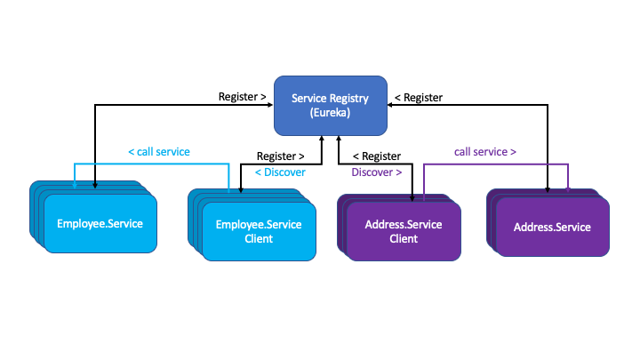
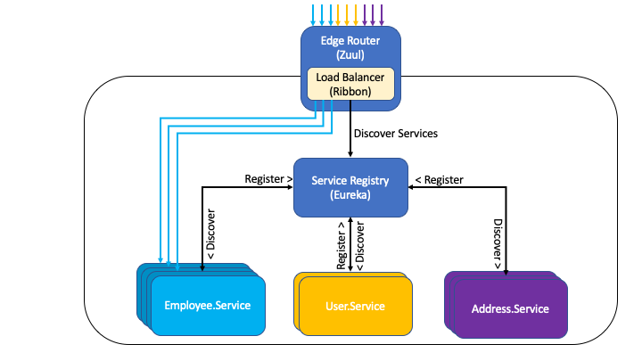
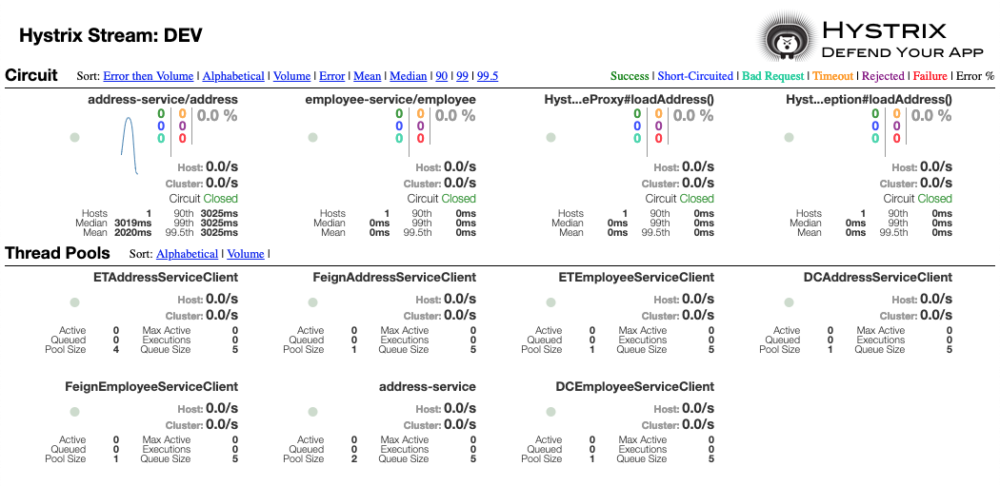
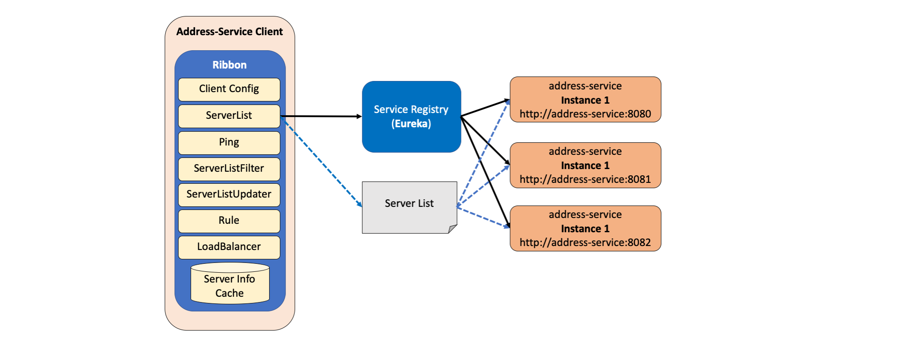
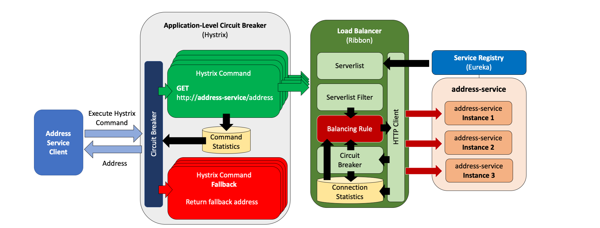
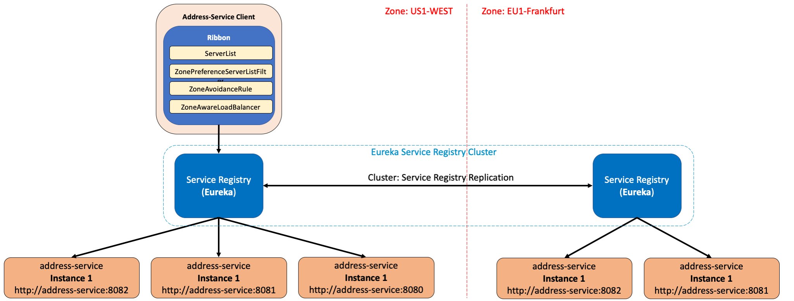
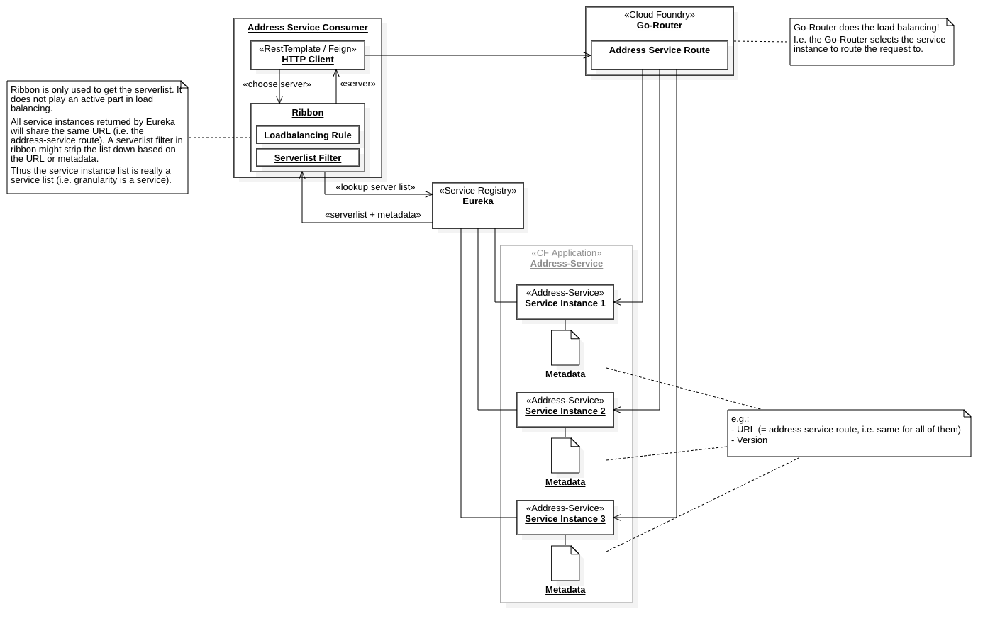
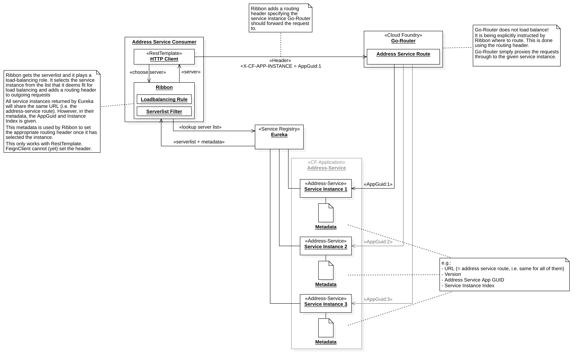
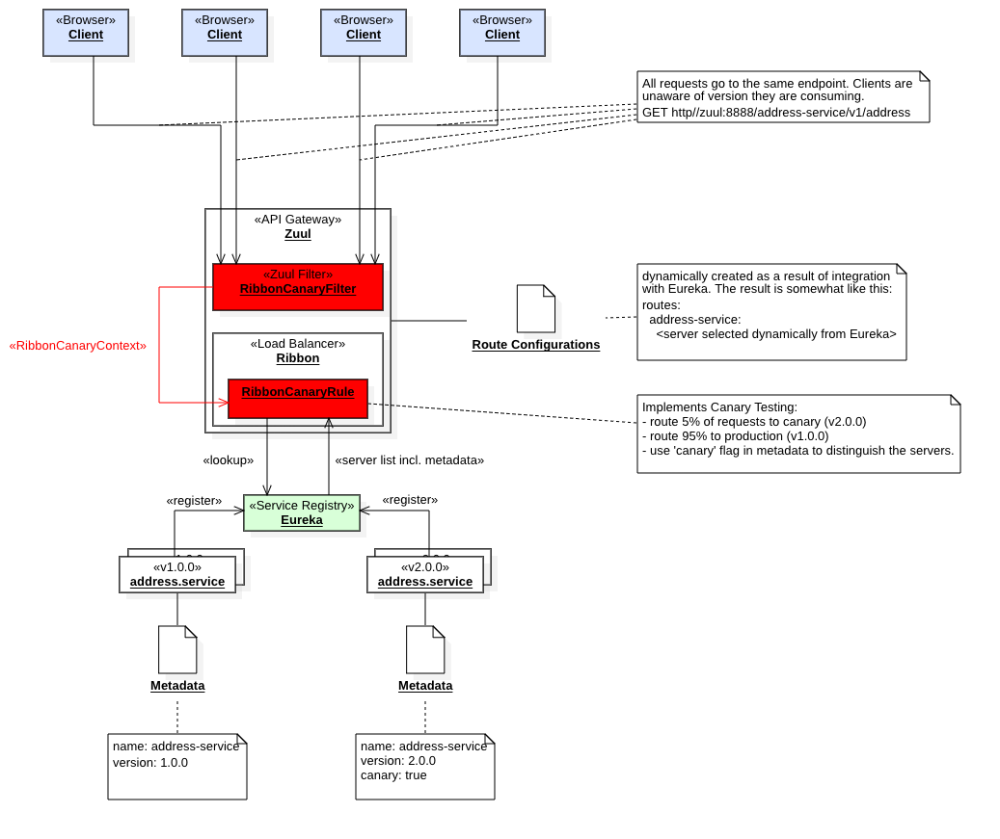

# Cloud Development with Spring-Netflix

This project shows how to integrate and run various Netflix Open Source components on Cloud Foundry to achieve 
Cloud operations, resilience and performance qualities.

Eventually, we are creating a **landscape blue-print**, which should enable teams to get started in the cloud more quickly using Spring Boot and the battle-tested Netflix stack. We take great care that all of the components shown here can be run locally as well as deployed in Cloud Foundry without modifications.

This project is structured in **various branches**. 

| Branch Name                                                               | Description                                                                        |
| ------------------------------------------------------------------------- | ---------------------------------------------------------------------------------- |
| **master**                                                                | shows how to run Eureka (a dynamic service registry) in Cloud Foundry.             |
| **master-with-zuul**                                                      | expands on the previous branch and adds basic Netflix Zuul capabilities.           |
| **master-with-zuul-hystrix**                                              | adds Hystrix circuit breaking to the landscape.                                    |
| **master-with-zuul-hystrix-turbine**                                      | bundles Hystrix streams from various services via Turbine and aggregates them in a live dashboard. |
| **master-with-zuul-hystrix-turbine-ribbon**                               | adds Ribbon client-side loadbalancer and service instance selection.               |
| **master-with-zuul-hystrix-turbine-ribbon-cf**                            | makes Ribbon loadbalancing available on Cloud Foundry.                             |
| **master-with-zuul-hystrix-turbine-ribbon-cf-canarytesting**              |  shows an advanced setup of Zuul implementing a canary testing strategy as a Zuul filter and Ribbon rule. Also includes sample filters for Zuul. |
| **master-with-zuul-hystrix-turbine-ribbon-cf-canarytesting-oauth2**       | integrates Spring Security OAuth2.0 with Zuul. Allows for integration with standard OAuth2.0 Authorization servers. |

Make sure to look out for more available branches integrating more Netflix features as we are step by step completing the picture.

Table of Contents
=================

   * [Deployment](#deployment)
   * [Eureka](#eureka)
      * [Eureka Server Application](#eureka-server-application)
         * [Maven Dependencies for Eureka Server](#maven-dependencies-for-eureka-server)
         * [Eureka Server Spring Boot Application](#eureka-server-spring-boot-application)
         * [Eureka Server Configuration](#eureka-server-configuration)
         * [Eureka Server Manifest.yml](#eureka-server-manifestyml)
      * [Eureka Clients](#eureka-clients)
         * [Address Service](#address-service)
            * [Maven Dependencies](#maven-dependencies)
            * [Address Service Eureka Client Configuration](#address-service-eureka-client-configuration)
         * [Cloud Deployment Configurations](#cloud-deployment-configurations)
            * [Address Service Manifest.yml](#address-service-manifestyml)
         * [Address Service Client](#address-service-client)
            * [Service Discovery with Discovery Client](#service-discovery-with-discovery-client)
            * [Service Discovery Using Loadbalanced RestTemplate](#service-discovery-using-loadbalanced-resttemplate)
            * [Service Discovery Using Feign Client](#service-discovery-using-feign-client)
   * [What did we gain so far? - Or: Why The Hassle?](#what-did-we-gain-so-far---or-why-the-hassle)
   * [Using Custom Service Metadata](#using-custom-service-metadata)
      * [Static Custom Service Metadata](#static-custom-service-metadata)
   * [Zuul](#zuul)
      * [What is Zuul](#what-is-zuul)
      * [Resiliency with Zuul](#resiliency-with-zuul)
      * [Project Setup](#project-setup)
         * [Zuul Spring Boot Application](#zuul-spring-boot-application)
         * [Maven Dependencies](#maven-dependencies-1)
         * [Zuul Configurations](#zuul-configurations)
         * [Deploying Zuul Service](#deploying-zuul-service)
         * [Testing Zuul](#testing-zuul)
      * [Advanced Zuul Configurations](#advanced-zuul-configurations)
         * [Location Header Rewriting](#location-header-rewriting)
         * [Cross Origin Requests](#cross-origin-requests)
   * [Hystrix](#hystrix)
      * [What is Circuit Breaking](#what-is-circuit-breaking)
      * [What Does Hystrix Do?](#what-does-hystrix-do)
         * [Hystrix and Reactive Java](#hystrix-and-reactive-java)
      * [Integrating Hystrix](#integrating-hystrix)
         * [Address Service Changes](#address-service-changes)
         * [Address Service Client Changes](#address-service-client-changes)
         * [Implicit Hystrix Integration](#implicit-hystrix-integration)
      * [The Hystrix Dashboard Application](#the-hystrix-dashboard-application)
      * [Trying Out Hystrix](#trying-out-hystrix)
      * [The Need for Command Keys](#the-need-for-command-keys)
      * [Hystrix Alternatives](#hystrix-alternatives)
   * [Turbine](#turbine)
      * [Running Turbine](#running-turbine)
      * [Integrating Turbine](#integrating-turbine)
      * [Configuring Turbine](#configuring-turbine)
      * [Using Clusters Properly](#using-clusters-properly)
         * [Clustering by Landscape](#clustering-by-landscape)
         * [Clustering by Service](#clustering-by-service)
         * [Clustering by AWS Auto-Scaling Groups](#clustering-by-aws-auto-scaling-groups)
         * [Debugging Cluster Configurations](#debugging-cluster-configurations)
      * [Registering Turbine Streams with Hystrix Dashboard](#registering-turbine-streams-with-hystrix-dashboard)
      * [Turbine Limitations](#turbine-limitations)
   * [Ribbon](#ribbon)
      * [Ribbon Concepts](#ribbon-concepts)
      * [Integration with Hystrix](#integration-with-hystrix)
      * [Server Lists and Zone-based Matching](#server-lists-and-zone-based-matching)
      * [Eureka Integration](#eureka-integration)
      * [Integrating Ribbon](#integrating-ribbon)
         * [Adding Ribbon Dependencies to pom.xml](#adding-ribbon-dependencies-to-pomxml)
         * [Ribbon Configurations](#ribbon-configurations)
         * [Adjusting Hystrix Timeouts](#adjusting-hystrix-timeouts)
         * [Maintaining Zone Information](#maintaining-zone-information)
      * [Ribbon in Action](#ribbon-in-action)
         * [Note for Cloud Foundry Deployments](#note-for-cloud-foundry-deployments)
   * [Ribbon On Cloud Foundry](#ribbon-on-cloud-foundry)
      * [Solution Description: Ribbon taking over load balancing from Go-Router](#solution-description-ribbon-taking-over-load-balancing-from-go-router)
         * [Adding Required Metadata](#adding-required-metadata)
         * [Adding the Load Balancing Request Interceptor](#adding-the-load-balancing-request-interceptor)
      * [Trying It Out](#trying-it-out)
      * [Summary](#summary)
   * [Canary Testing with Zuul](#canary-testing-with-zuul)
      * [Understanding Zuul Filters](#understanding-zuul-filters)
         * [Default Filters](#default-filters)
      * [Dynamic Filters with Groovy](#dynamic-filters-with-groovy)
         * [How Netflix Use(d) Groovy Filters](#how-netflix-used-groovy-filters)
      * [Simple Sample Filter Implementations](#simple-sample-filter-implementations)
      * [Creating Zuul Route Programmatically](#creating-zuul-route-programmatically)
      * [Case Study: A Canary Testing Filter with Zuul and Ribbon](#case-study-a-canary-testing-filter-with-zuul-and-ribbon)
         * [Conceptual Background](#conceptual-background)
         * [Implementation](#implementation)
            * [A New address.service Version](#a-new-addressservice-version)
            * [Canary Testing Zuul Filter](#canary-testing-zuul-filter)
            * [Ribbon Canary Testing Rule](#ribbon-canary-testing-rule)
         * [Trying It Out](#trying-it-out-1)
      * [Summary](#summary-1)
   * [Integrating Zuul with OAuth 2.0 and Spring Cloud Security](#integrating-zuul-with-oauth-20-and-spring-cloud-security)
      * [Pre-Requisite: The Authorization Server](#pre-requisite-the-authorization-server)
         * [Running the Authorization Server](#running-the-authorization-server)
         * [Authorization Server Configurations](#authorization-server-configurations)
      * [Running Zuul against the local Authorization Server](#running-zuul-against-the-local-authorization-server)
         * [What has just happened?](#what-has-just-happened)
      * [Enabling OAuth 2.0 SSO Support in Zuul](#enabling-oauth-20-sso-support-in-zuul)
         * [Adding Maven Dependencies](#adding-maven-dependencies)
         * [Adding ZuulWebSecurityConfiguration Class](#adding-zuulwebsecurityconfiguration-class)
         * [Adding Zuul Configurations](#adding-zuul-configurations)
            * [The OAuth 2.0 Configurations](#the-oauth-20-configurations)
            * [The Zuul Session Cookie Name](#the-zuul-session-cookie-name)
            * [Adjusting Zuul's Sensitive Headers Setting](#adjusting-zuuls-sensitive-headers-setting)
         * [Adding ZuulAuthorizationHeaderProxyFilter](#adding-zuulauthorizationheaderproxyfilter)
         * [Debug Utilities](#debug-utilities)
      * [Protecting Access to address.service](#protecting-access-to-addressservice)
         * [Adding Maven Dependencies](#adding-maven-dependencies-1)
         * [Adding OAuth 2.0 Configurations](#adding-oauth-20-configurations)
         * [Adding WebSecurityConfigurations Class](#adding-websecurityconfigurations-class)
         * [Spring Global Method Security](#spring-global-method-security)
      * [Further Reading](#further-reading)
   * [What's Next?](#whats-next)
   * [References](#references)

# Deployment

:gift: For easy deployment to Cloud Foundry, we provide a `manifest.yml` and `manifest-variables.yml` as well as a `cf-push.sh` shell script at the root of the project. **You will have to modify the `manifest-variables.yml` file and enter a unique ID where specified. This is to make deployment URLs unique.**

After having done that you can easily push all components to the Cloud in one go either by calling:

* `cf push --vars-file manifest-variables.yml` or
* `./cf-push.sh` as a short version

Some branches require Cloud Foundry services (e.g. XSUAA) to have been created. In this case, you will also find a `services-manifest.yml` and two shell scripts (`cf-create-services.sh` and `cf-create-services-push.sh` ) at the project root. Using the `Create-Service-Push` Cloud Foundry CLI plugin, you can use these to simply create service instances by calling either

* `cf create-service-push --no-push --vars-file manifest-variables.yml` (to just create the service instances) or
* `./cf-create-services.sh` as a short version or
* `./cf-create-services-push.sh` to first create the service instances then push the applications afterwards.

Note, that `./cf-create-services.sh` checks if the `Create-Service-Push` plugin is installed and if not will attempt to install it for you.

# Eureka

[Eureka](https://github.com/Netflix/eureka) is a dynamic service registry (and client) developed by Netflix.
If you want to understand Eureka in detail and how it is used by Netflix (on AWS) you can have a look at [this page](https://github.com/Netflix/eureka/wiki/Eureka-at-a-glance).

For our purposes, Eureka can serve as
- a service registry for various microservices and -versions.
- a mechanism for dynamic service discovery
- a way of advertising service metadata to possible clients (to be verified)

Furthermore, Eureka can provide the basis for intelligent and highly dynamic load balancing, and aid in realizing canary deployments, blue green deployments and true zero downtime.

While we will focus on these more advanced use cases in other branches of this project, here we focus on how to configure and run Eureka in Cloud Foundry.

For now we build the following scenario:  


Eureka plays the role of a service registry and there are two services (`employee.service` and `address.service`) that register to Eureka.  
Their clients (also realized as services) register to Eureka as well, but first and foremost use Eureka to lookup / discover one or more instances of the services they consume. Once the service instances have been discovered, the clients call the instances directly.

## Eureka Server Application

The Eureka server, i.e. the actual service registry, is a Spring Boot application located in the [eureka.service](./eureka.service) folder.  
To run the application locally, proceed as follows:

- In `eureka.service` folder execute `mvn clean package`
- Execute `java -jar ./target/eureka.service-0.0.1-SNAPSHOT.jar`

To deploy Eureka Server on Cloud Foundry, proceed as follows:

- Log in to your Cloud Foundry account and space using `cf login`
- In `eureka.service` folder execute `mvn clean package`
- Execute `cf push --vars-file ../manifest-variables.yml`

### Maven Dependencies for Eureka Server
First you need to add the proper dependencies to your maven pom.xml

```xml
<dependencies>
    <dependency>
        <groupId>org.springframework.cloud</groupId>
        <artifactId>spring-cloud-starter-netflix-eureka-server</artifactId>
    </dependency>
</dependencies>

...

<dependencyManagement>
    <dependencies>
        <dependency>
            <groupId>org.springframework.cloud</groupId>
            <artifactId>spring-cloud-dependencies</artifactId>
            <version>Greenwich.RELEASE</version>
            <type>pom</type>
            <scope>import</scope>
        </dependency>
    </dependencies>
</dependencyManagement>
```

This uses the mechanism of a Maven bill of material (BOM). In the `dependencyManagement` section a dependency to a `pom.xml` file is declared, which specifies compatible versions of Spring cloud libraries (which Netflix Eureka Server is a part of).  
As a consequence, the dependency to `spring-cloud-starter-netflix-eureka-server` is not specified with a version, but the version is coming from the BOM.

### Eureka Server Spring Boot Application

All that is required to make the Spring Boot application a Eureka server, is to add the `@EnableEurekaServer` annotation.

```java
@SpringBootApplication
@EnableEurekaServer
public class App {

    public static void main(String[] args) {
        SpringApplication.run(App.class, args);
    }
}
```

### Eureka Server Configuration

Eureka server is configured (as any Spring Boot application) in an [`application.yml`](./eureka.service/src/main/resources/application.yml) file. The file looks as follows:

```yaml
---
spring:
  application:
    name: eureka-server

server:
  port: ${PORT:8761}
 
eureka:
  instance:
    hostname: ${vcap.application.uris[0]:localhost}
  client:
    registerWithEureka: false
    fetchRegistry: false
    serviceUrl:
      defaultZone: http://${eureka.instance.hostname}:${server.port}/eureka
```

First, the name of the application is specified (in this case _eureka-server_).  
Then the port Eureka is running on needs to be specified. In this case, since we want to be able to run Eureka server on a local machine for testing as well as in a Cloud Foundry environment, we specify the port to by either the value of the `PORT` environment variable injected into every Cloud Foundry application by the Cloud Foundry runtime (usually defaults to port `8080`) or port `8761` if no `PORT` variable was found on the environment.

The next set of configurations turn the Eureka application into a standalone server.  
Eureka servers can also be (and usually are) deployed as clusters and across Cloud regions / zones.  
If deployed as a cluster, the Eureka server instances form a peer-to-peer network, and each Eureka server instance also acts as a client to its peers. In fact, this is the default behaviour when you run Eureka out of the box. As a result, when deploying just one instance of Eureka server, you will see some exceptions related to Eureka not finding its peers. Although these are just warnings, they may distract from other problems.  
With the configurations above, we disable this feature and make the Eureka instance run as a standalone server. Note, that for productive uses this is not recommended! See the Eureka documentation for more details.

With the configurations above, the Eureka server instance will use the hostname as given by the first URI in the `VCAP_APPLICATION` environment variable, if it is defined. Otherwise it will fall back to `localhost`. Thus, the Eureka Spring Boot application is runnable both locally as well as in Cloud Foundry.

### Eureka Server Manifest.yml

To deploy the Eureka server to Cloud Foundry, the `manifest.yml` should look as follows:

```yaml
---
applications:
- name: <a unique ID>-eureka-server
  memory: 1024M
  disk_quota: 512M
  instances: 1
  buildpack: java_buildpack
  path: ./target/eureka.service-0.0.1-SNAPSHOT.jar
  
  routes: 
  - route: <a unique ID>-eureka-server.<your.cf.domain>
```

We have outsourced `<a unique ID>` and other deployment-specific variables to a dedicated [`manifest-variables.yml`](./manifest-variables.yml) file located at the root of this project.  
You can simply push Eureka server to Cloud Foundry by executing `cf push --vars-file ../manifest-variables.yml` from the `eureka.service` folder.  

## Eureka Clients

Eureka clients are services that register to Eureka server.  

Services use the `spring-cloud-starter-netflix-eureka-client` library to find, connect and register to Eureka server.  
The Eureka server needs to be configured in every client (service).  
Note, that this does **not mean** that it needs to be hard coded - it could also be injeced via an environment entry.

A service _registers_ itself by a given name. That name can be used by other services to _look up_ that service from the Eureka server (registry).

In this project, we have created 4 Eureka clients. 

1. [address.service](./address.service)
2. [address.service.client](./address.service.client)
3. [employee.service](./employee.service)
4. [employee.service.client](./employee.service.client)

[address.service](./address.service) and [employee.service](./employee.service) are actual services, i.e. they provide a REST API that their clients are going to call. They register with Eureka Server and can subsequently be discovered by [address.service.client](./address.service.client) and [employee.service.client](./employee.service.client).

[address.service.client](./address.service.client) and [employee.service.client](./employee.service.client) are also realized as services, even though they act as clients to `address.service` and `employee.service`, respectively.   
Since they have also been configured as Eureka Clients, they also register with Eureka Server. This may seem confusing, but in reality, a consumer (client) of a service is often a service itself, so it makes sense to have them register to the service registry as well.

In the following we will show the configurations of one client-service-pair using [address.service](./address.service) and [address.service.client](./address.service.client). The descriptions are analogous for [employee.service](./employee.service) and [employee.service.client](./employee.service.client).

### Address Service 

[address.service](./address.service) is a plain Spring Boot application that exposes a REST controller serving addresses (city, postal code, etc.).  
To run [address.service](./address.service), proceed as follows:

- In `address.service` folder execute `mvn clean package`
- Execute `java -jar ./target/address.service-0.0.1-SNAPSHOT.jar`

To deploy to Cloud Foundry, proceed as follows:

- Login to your account and space using `cf login`
- In `address.service` folder, execute `mvn clean package`
- Execute `cf push --vars-file ../manifest-variables.yml`

You can deploy Eureka Server and `address.service` in any order you like. They will find each other! 
If you have Eureka Server running, you can inspect `http://localhost:8761/eureka` or `https://<a unique ID>-eureka-server.<your.cf.domain>/eureka` respectively. This will show you the server's Web UI where you should see `address.service` registered now (together with information about the service instance(s)).

#### Maven Dependencies

 In code there is nothing specific to Eureka.  
 However, you need to have the proper Eureka client dependencies on your classpath and in your `pom.xml`

```xml
<dependencies>
    <dependency>
      <groupId>org.springframework.cloud</groupId>
      <artifactId>spring-cloud-starter-netflix-eureka-client</artifactId>
    </dependency>
    
    <!-- Required for health checks and info pages advertised by the service and read by Eureka -->
    <dependency>
      <groupId>org.springframework.boot</groupId>
      <artifactId>spring-boot-starter-actuator</artifactId>
    </dependency>
</dependencies>

...

<dependencyManagement>
    <dependencies>
        <dependency>
            <groupId>org.springframework.cloud</groupId>
            <artifactId>spring-cloud-dependencies</artifactId>
            <version>Greenwich.RELEASE</version>
            <type>pom</type>
            <scope>import</scope>
        </dependency>
    </dependencies>
</dependencyManagement>
```

#### Address Service Eureka Client Configuration

By having `spring-cloud-starter-netflix-eureka-client` on its classpath, Address Service automatically acts as a Eureka client - meaning, it will try to look for a Eureka Server instance to register itself to.

In order to succeed, you need the following configurations in [`application.yml`](./address.service/src/main/resources/application.yml):

```yaml
---
spring:
  application:
    name: address-service

server:
  port: ${PORT:8080}

eureka:
  client: 
    serviceUrl:
      defaultZone: http://localhost:8761/eureka
  instance:
    healthcheck: 
      enabled: true

---
... # cloud profile (see below)
```

This is a little more involved, as it uses **Spring Cloud Profiles** and some environment variables set in `manifest.yml`.

First, we specify the name of the service - `address-service` - using the `spring.application.name`.  
Then we specify the port that the service will be running on. Again, this tries to read the port from the environment, and if not set, will default to port `8080`.

Next, using `eureka.client.serviceUrl.defaultZone` we specify the Eureka server URI, where to connect and register to. In a local environment, this will be a URI pointing to `localhost`. However, we will see below, how this can be overridden in a Cloud deployment scenario.

The `eureka.instance.healthcheck.enabled` property tells the Eureka Client not just to send a _heartbeat_ to the server to indicate it is healthy, but actually the _application-defined_ health status which can be controlled using **Spring Actuator** framework. Though not strictly necessary, it allows a Spring Boot application like `address.service` to expose a `/health` endpoint returning a JSON structure that can contain application-defined health information. See the [Spring Cloud Netflix documentation](https://cloud.spring.io/spring-cloud-netflix/single/spring-cloud-netflix.html) for details.

### Cloud Deployment Configurations

When deploying to Cloud Foundry, we need slightly different configurations.  
We use Spring Cloud Profiles to achieve this:

```yaml
---
... # default profile (see above)
      
---
spring.profiles: cloud

eureka:
  client: 
    serviceUrl:
      defaultZone: ${eureka-server-url}/eureka  # URL of the form https://<unique prefix>-eureka-server.<your.cf.domain>/eureka
                                                # Resolved from environment set in manifest.yml
  instance:
    ## set the host name explicitly when in Cloud Foundry.
    hostname:             ${vcap.application.uris[0]:localhost}
    nonSecurePortEnabled: false
    securePortEnabled:    true
    securePort:           443
    homePageUrl:          https://${vcap.application.uris[0]:localhost}/   
    statusPageUrl:        https://${vcap.application.uris[0]:localhost}/actuator/info 
    healthCheckUrl:       https://${vcap.application.uris[0]:localhost}/actuator/health
    secureHealthCheckUrl: https://${vcap.application.uris[0]:localhost}/actuator/health
```

First we define a new profile named `cloud` using the `spring.profiles: cloud` directive.  
All properties below it, will only be active, if the `cloud` profile is active. 

We need to set `eureka.client.serviceUrl.defaultZone` to point to the deployment URL of the Eureka server instance.  
We could hardcode the value according to the route of our deployed Eureka server, but a better approach is to look up the Eureka server URL from the environment.  
The line `defaultZone: ${eureka-server-url}/eureka` does exactly that. It searches for a variable `eureka-server-url` in the environment of the `address.service` application. We make sure that the `eureka-server-url` is in the environment by adding it in `address.service`'s [`manifest.yml`](./address.service/manifest.yml).

```yaml
...
  env:
    eureka-server-url: https://...
```

In a Cloud Foundry environment we need to explicitly set `eureka.instance.hostname` (i.e. the host name of the Eureka client).
A simple way to do that, without hardcoding it, is to consult the `VCAP_APPLICATION` environment variable that Cloud Foundry injects.  
In the configuration above, we use `vcap.application.uris[0]` to reference the first URI found in the `VCAP_APPLICATION` environment of `address.service`. At runtime, this will be the hostname of the route that is maintained in `manifest.yml`.  
If no URI was found, we default to `localhost`.

Next, we enforce HTTPS. We do so by disabling HTTP (`nonSecurePortEnabled: false`), enabling HTTPS (`securePortEnabled: true`) and specifying which port to use for HTTPS (`securePort: 443`).

As a last configuration step, we need to explicitly expose the URLs for ...
- home page
- status page
- health check URL and
- secure health check URL, 
... that will be exposed by `address.service` when it registers to Eureka. You will find the home page as a link in the Eureka UI (just click on an instance).  
The rest will be exposed as metadata and can be looked up by Eureka clients, i.e. other services.

Finally, we need to make sure that the cloud profile is activated, when we are deploying to Cloud Foundry.  
A Spring Cloud profile can be activated in various ways. The mechanism we use, is to set the `spring.profiles.active` environment variable which we set to `cloud` in [`manifest.yml`](./address.service/manifest.yml).

#### Address Service Manifest.yml

The `manifest.yml` for `address.service` is rather straight forward.

```yaml
---
applications:
- name: ((unique-prefix))-address-service
  memory: 1024M
  disk_quota: 512M
  instances: 1
  buildpacks:
    - java_buildpack
  path: ./target/address.service-0.0.1-SNAPSHOT.jar
  
  routes: 
  - route: ((unique-prefix))-address-service.<your.cf.domain>
  
  env:
    spring.profiles.active: cloud # activate the spring profile named 'cloud'.
    eureka-server-url: https://((eureka-server-route))
```

Note the `route` property. This will reflect in the URI in `VCAP_APPLICATION` that we referenced in the Eureka Client configuration.  
We are using a manifest variable `unique-prefix` which we maintain in `manifest-variables.yml`. This makes it easy to change the unique name prefix depending on your needs or landscape.

Also note the `spring.profiles.active` environment entry that activates the `cloud` profile we defined in `application.yml`.

Finally, note that we are injecting the `eureka-server-url` into the environment (again making use of a variable from `manifest-variables.yml`).  
This environment variable is referenced by `application.yml` as well.

With this relatively simple and straight-forward set of configurations, we have achieved:
- deployment on Cloud Foundry
- local deployment
- outsourcing of user- / landscape-specific prefixes and variables.

This is a highly flexible setup that will allow you to deploy and test both locally as well as in the Cloud!

### Address Service Client

`address.service.client` is a plain Spring Boot application. It declares the same dependencies to `spring-cloud-starter-netflix-eureka-client` and `spring-boot-starter-actuator` as `address.service`. Thus, it also acts as a Eureka Client and registers itself with the Eureka Server.  
Also, `address.service.client`'s `application.yml` is very similar to that of `address.service`.

It is interesting, however, how `address.service.client` uses Eureka Server to **discover** `address.service` from the registry and then calls it.  
This is codified in [3 different ways](https://spring.io/blog/2015/01/20/microservice-registration-and-discovery-with-spring-cloud-and-netflix-s-eureka) in the following classes:

* [DCAddressServiceClient](./address.service.client/src/main/java/com/sap/cloud/address/service/client/DCAddressServiceClient.java) - an implementation based on `DiscoveryClient`, which programmatically queries Eureka for service instances.
* [ETAddressServiceClient](./address.service.client/src/main/java/com/sap/cloud/address/service/client/ETAddressServiceClient.java) - an implementation using *loadbalanced* `RestTemplate`. 
* [FeignAddressServiceClient](./address.service.client/src/main/java/com/sap/cloud/address/service/client/FeignAddressServiceClient.java) - an implementation using Spring Cloud's declarative REST client Open Feign.

In the following, we will describe these approaches in more detail.

#### Service Discovery with Discovery Client

In this implementation, we use Spring's `DiscoveryClient` and `EurekaClient` from Netflix to lookup services instances in Eureka, retrieve their URLs and calling them using RestTemplate (or any other HTTP client).  

Both Eureka clients are possible options. However, `EurekaClient` provides a lot more details about registered service instances.   
Spring's `DiscoveryClient` is an abstraction intended for service lookups from any supported service registry - not just Eureka. As such, its capabilities are more limited.

```java
public class DCAddressServiceClient {
    
    @Autowired
    private DiscoveryClient discoveryClient;

    @Autowired
    private EurekaClient eurekaClient;

    public void getAddress() throws RestClientException, IOException {
        
        String baseUrlFromEurekaClient = getServiceURLwithEurekaClient();
        String baseUrlFromSpringDiscoveryClient = getServiceURLwithSpringDiscoveryClient();
        
        System.out.println("--> Service URL from Eureka Client: " + baseUrlFromEurekaClient);           // with    trailing '/' 
        System.out.println("--> Service URL from Spring Client: " + baseUrlFromSpringDiscoveryClient);  // without trailing '/'

        String baseUrl = baseUrlFromSpringDiscoveryClient;
        baseUrl = baseUrl + "/address";

        System.out.println("Address Service Instance Address: " + baseUrl);

        RestTemplate restTemplate = new RestTemplate();

        ResponseEntity<String> response = null;
        try {
            response = restTemplate.exchange(baseUrl, HttpMethod.GET, getHeaders(), String.class);
        } catch (Exception ex) {
            System.out.println(ex);
        }
        System.out.println(response.getBody());
    }
    ...

    private String getServiceURLwithSpringDiscoveryClient() {
        
        List<ServiceInstance> instances = discoveryClient.getInstances("address-service");
        
        dumpServiceInstancesInformationFromSpringDiscoveryClient(instances);
        
        ServiceInstance serviceInstance = instances.get(0);
        return serviceInstance.getUri().toString();
    }

    ...
    
    private String getServiceURLwithEurekaClient() throws JsonProcessingException {

        List<InstanceInfo> serviceInstances = eurekaClient.getInstancesByVipAddress("address-service", false);

        dumpServiceInstancesInformationFromEurekaClient(serviceInstances);

        InstanceInfo instanceInfo = serviceInstances.get(0);
        return instanceInfo.getHomePageUrl();
    }
}
```

In the snippet above, a `DiscoveryClient` and `EurekaClient` instance is autowired and used to get instances of a service that is registered by a given name to Eureka - in this case `address-service`.  

Every service instance has a URI by which it can be accessed by an HTTP client. But there are other interesting properties.  
For exmaple, a service instance may offer *metadata*. That metadata can be customized and might contain information about the service's (not necessarily REST-only) APIs. This metadata can be used by clients to find out more about the capabilities or features of the service.

Since there may be several instances of the service running, both `DiscoveryClient` and `EurekaClient` return references to each of them.   
Clients can thus pick a specific instance to communicate with.

[Netflix Zuul](https://github.com/Netflix/zuul/wiki) and [Netflix Ribbon](https://github.com/Netflix/ribbon) framework use this mechanism to realize load balancing.   

Note, that `DiscoveryClient` is a Spring Cloud abstraction on top of `EurekaClient` which acts as an implementation and needs to be on the classpath by including the dependency `spring-cloud-starter-netflix-eureka-client` in pom.xml

#### Service Discovery Using Loadbalanced RestTemplate

`RestTemplate` is one of Spring's way to make REST calls. Underlying `RestTemplate` is an HTTP client implementation that can differ depending on what is on the classpath. In particular, if your classpath contains Netflix Ribbon - a client-side loadbalancer - `RestTemplate` will use Ribbon to make (loadbalanced) HTTP requests.

Ribbon, on the other hand, has a tight integration with Eureka, and is capable of dynamically discovering service instances registered to Eureka and balancing load between them.

As a result, using Ribbon in combination with `RestTemplate` makes service discovery and calling services easier. [`ETAddressServiceClient`](./address.service.client/src/main/java/com/sap/cloud/address/service/client/ETAddressServiceClient.java) makes use of this approach:

```java
public class ETAddressServiceClient {

    @Autowired
    private RestTemplate restTemplate;
    
    public void getAddress() throws RestClientException, IOException {
        Address address = restTemplate.getForObject("http://address-service/address", Address.class);
        
        System.out.println("Address from RestTemplate: ");
        System.out.println(address.toString());
    }
}
```

The `RestTemplate` is autowired and used to look up and call the remote `address.service`'s endpoint.  

Note in particular, that the URI `http://address-service/address` **does not specify the real service URL!**  
Instead, it references the service's ID (`address-service`) as registered in Eureka (i.e. the `vip address` in Netflix terms).   
Ribbon's HTTP client will look up the service, pick a service instance and then call its `/address` endpoint. The JSON returned by the endpoint is then unmarshalled into an `Address` object instance, automatically.

For this to work, two more things are required.  
First, you need to annotate your Spring Boot application class with `@EnableDiscoveryClient`:

```java
@SpringBootApplication
@EnableDiscoveryClient
public class ClientApp {
  ...
}
```

Second, you need to declare a `@Bean` returning a *loadbalanced* `RestTemplate` in your Spring Boot configuration:

```java
@Bean
@LoadBalanced
public RestTemplate restTemplate() {
    return new RestTemplate();
}
```

Note the `@LoadBalanced` annotation, which automatically injects `Ribbon` as the underlying load balancer into the returned `RestTemplate` instance. 

#### Service Discovery Using Feign Client

Feign client is a declarative REST client developed and open-sourced by Netflix and made available by Spring Cloud.

Feign Client integrates tightly with Eureka and can enormeously simplify discovery and REST-based access to remote services.

[`FeignAddressServiceClient`](./address.service.client/src/main/java/com/sap/cloud/address/service/client/FeignAddressServiceClient.java) makes use of this approach:

```java
@Component
public class FeignAddressServiceClient {

    @Autowired
    private AddressServiceProxy addressServiceProxy;

    public void getAddress() {
        Address address = addressServiceProxy.loadAddress();
        
        System.out.println("Address from FeignClient: ");
        System.out.println(address.toString());
    }
}

@FeignClient("address-service") // 'address-service' is the name of the service in Eureka!
interface AddressServiceProxy {
    @RequestMapping(method = RequestMethod.GET, value = "/address")
    Address loadAddress();
}
```

In this example, `AddressServiceProxy` is simply an annotated interface that serves as a client-side proxy for the remote `address.service` and will be backed / implemented by FeignClient. The `@FeignClient("address-service")` annotation declares the ID of the service to call as registered in Eureka. The `@RequestMapping` annotation on the `loadAddress()` method specifies the path / endpoint to call - this may also include variables that can be resolved with method parameters (see [details here](https://spring.io/blog/2015/01/20/microservice-registration-and-discovery-with-spring-cloud-and-netflix-s-eureka)).

`FeigAddressServiceClient` then simply autowires an instance of `AddressProxy` created by Feign and calls its `loadAddress()` method.

For this to work, you need to do two more things.
First, you need to add the following dependency to your `pom.xml`:

```xml
<dependency>
  <groupId>org.springframework.cloud</groupId>
  <artifactId>spring-cloud-starter-openfeign</artifactId>
</dependency>
```

Second, you need to annotate your Spring Boot application class with `@EnableFeignClients`:

```java
@SpringBootApplication
@EnableFeignClients
public class ClientApp {
  ...
}
```

**Note:** Both loadbalanced `RestTemplate` and `FeignClient` use the service ID / alias name as registered in Eureka rather than the exact physical URL of the service instance. This abstraction not only hides the fact that there may be multiple service instances from clients, but it also provides a *logical grouping* of service instances into a *logical service*. This abstraction makes it possible to change and exchange service instances "under the hood" without clients being aware of it. This opens the door for powerful dev ops strategies like blue-green, canary and with it true zero-downtime deployments!

# What did we gain so far? - Or: Why The Hassle?

If you have read the last section carefully and know a little bit about Cloud Foundry you may have been thinking: "Cloud Foundry already has a load balancer! So,  even if I have multiple instances of a service registered, they all share the same URI, why do I need Eureka then? I cannot pick a dedicated instance to talk to anyway!"

Indeed, Cloud Foundry already provides its own load balancer: the Go-Router.   
In fact, if you deploy `eureka.service` and `address.service` to the Cloud and create 3 instances of `address-service` they will each share the exact same URI, i.e. Cloud Foundry **route**.  
Hence, a client cannot connect to a specific instance. Instead, a client makes a call to the given URI and Cloud Foundry's Go-Router will route / balance the request to an instance it deems fit to handle it.

However, using Eureka you gain a dynamic mechanism to add and remove services from your Cloud (product) landscape. This allows you to provide a runtime catalog of available services to your Cloud users, and allows technical clients to discover the endpoints they need to communicate with. Paired with meaningful metadata exposed by your services, this can be powerful feature.

Furthermore, Eureka can not only be valuable for your customers but also your operations teams.  
Consider the following scenario: 

- You have v1 of your service deployed and it exposes its version information `version: 1.0.0` as metadata.
- You may have multiple instances of that service running, and Eureka will return each of them by the same route.
- You have a smart / dynamic router (like Netflix Zuul or Hybris' Jupiter) connected to Eureka and all services and service clients always communicate via that router
- Now if you have a v2 of your service ready, and would like to switch some or all of the clients using v1 of your service to v2.
- Given that the smart router supports it, you could now do the following:
  - You deploy v2 of your service to Cloud Foundry and have it expose `version: 2.0.0` as metadata.
  - You have v2 of your service register to Eureka server by the same logical service name as v1, but they register by a new route.
  - Clients do not see the new route, they only see the logical service name, so they will not even notice there is a v2 of your service available under the hood.
  - The dynamic router will now be able to look up the new instances and be able to distinguish them by the different version metadata.
  - Based on the metadata of a service instance returned by Eureka, the dynamic router can now decide where to route specific clients' requests. For example, if there is a list of clients that should act as canary users for v2 of your service, the dynamic router could read that list and dynamically route all requests from the given clients to the instances of `version: 2.0.0`.

This allows you to switch clients / users to new versions of your software without them noticing, thus incurring no downtime at all.

# Using Custom Service Metadata

One major benefit of Eureka is that services can provide metadata describing their instances. This metadata is passed to Eureka server when the service registers.  
Clients can inspect that metadata when they look up services they want to consume. If you are using Netflix Ribbon or Zuul, then you can create rules or filters that act upon that metadata to select service instances to balance traffic or route clients to.

There is a certain set of default metadata that all Eureka instances will provide (e.g. the management port, the JMX port, etc.). But the true power lies in the ability to provide custom metadata. This metadata could e.g. be:
- a description of the service
- links to documentation
- links to API endpoint descriptors (swagger files)
- descriptions of events the service emits, together with their structure and semantics.
- version information
- landscape / data center zone information
- etc.

The way this is done with Eureka is very simple:
1. You can statically define custom metadata in Eureka client configs, i.e. `application.yml`. We show this below.
2. You can [dynamically define the metadata in code](https://blog.codecentric.de/en/2018/01/spring-cloud-service-discovery-dynamic-metadata/)

## Static Custom Service Metadata 

The sample configuration below declares custom service metadata using the `eureka.instance.metadata-map` property.
This is the static way of declaring metadata. In this case we pretend that the service emits events (e.g. from Kafka or RabbitMQ), and describes the type and payload of the events using custom metadata.

```yaml
---
spring:
  application:
    name: address-service

server:
  port: ${PORT:8080}

eureka:
  client: 
    serviceUrl:
      defaultZone: http://localhost:8761/eureka
  instance:
    metadata-map:
      instanceId: "${vcap.application.instance_id:-}"
      events: > 
        { 
          [
            {
              "type" : "customerCreated", 
              "registry" : "https://kafka.registry.com"
            }, 
            {
              "type" : "customerDeleted", 
              "registry" : "https://kafka.registry.com"
            }
          ]
        }
```
**Note:** If you deploy `address.service` and `address.service.client`, you will see that when `address.service.client` starts up, it will look up an instance of `address-service` and print out the metadata it retrieved from the instance.  
You can try this out locally, or on Cloud Foundry. The metadata is printed to standard output.

# Zuul

## What is Zuul
[Netflix Zuul](https://github.com/Netflix/zuul/wiki) is a dynamic router, server-side loadbalancer and filter component that is used by Netflix as an edge router. Zuul can easily be integrated using [Spring Cloud Netflix](https://cloud.spring.io/spring-cloud-static/spring-cloud-netflix/2.1.0.RELEASE/single/spring-cloud-netflix.html#_router_and_filter_zuul) and can act as a **dynamic edge router** and **API gateway**.

Zuul and Eureka work hand in hand, using [Netflix Ribbon](https://github.com/Netflix/ribbon) under the hood to do load balancing across service instances that can **dynamically appear and disappear**. In other words, the picture (assuming you run only one Eureka and Zuul instance) looks like this:



Eureka acts as the service registry, and new services (and instances thereof) register to Eureka whenever they are deployed / started. These services can also use Eureka to lookup other services and contact them directly.  
Zuul uses Ribbon (a client-side loadbalancer) to route incoming requests the respective services and balance the load across multiple of their instances.  
Ribbon acts as a Eureka client, and looks up services that have registered themselves (and all their instances). Ribbon does so dynamically, i.e. new services that are registered to Eureka will immediately be available for routing as well as load balancing.  
Even more important: if services (or instances thereof) suddenly disappear as a result of failure, Ribbon can deal with that as well and balance load among the remaining ones.

Zuul uses convention over configuration for routing to services. By default, a service that is registered by *user-service* will be available as a (potentially new) route on Zuul as '/user-service'. In other words, if the user service gets started, it registers itself to Eureka and might be accessible under `https://user-service-host:port/` for direct access. However, it will automatically be accessible via Zuul by the URL `https://zuul-host:port/user-service`.  
Of course, you can restrict routes to not include certain service endpoints and completely change the default behaviour - up to the point where you manually configure a service whitelist Zuul will route to. But even without that, this dynamic behaviour can be a powerful tool.

## Resiliency with Zuul

Zuul uses Ribbon, which in turn uses Hystrix to enable circuit breaking. All requests issued by Zuul are therefore de-facto including circuit breaking.  
The picture above shows a deployment with only one Eureka instance and one Zuul instance. In production environments you should have several instances running. Eureka is capable of forming a peer-to-peer network of instances that share service registry state - even across availability zones and regions. 

## Project Setup

Zuul is a plain Spring Boot application. You can find it in the [zuul.service](./zuul.service) folder.  
You have to add the proper Maven dependencies to your `pom.xml` and configure Zuul's behaviour using an `application.yml`.

### Zuul Spring Boot Application

You can find the Spring Boot application incorporating Zuul server in [com.sap.cloud.zuul.service.App.java](./zuul.service/src/main/java/com/sap/cloud/zuul/service/App.java). All you need to enable Zuul server is the `@EnableZuulProxy` annotation.

```java
@SpringBootApplication
@EnableZuulProxy
public class App {
    public static void main(String[] args) {
        SpringApplication.run(App.class, args);
    }
}
```
For this to compile, you need to have the proper Maven dependencies on your classpath.

### Maven Dependencies

You need to add the following dependencies to your `pom.xml`:
```xml
  <dependency>
    <groupId>org.springframework.cloud</groupId>
    <artifactId>spring-cloud-starter-netflix-zuul</artifactId>
  </dependency>
  
  <!-- 
    Important: A Eureka Client needs to be on the classpath for Zuul to automatically detect
    services registered to Eureka, and do an automatic routing based on registered service name.
    E.g. a service registered as 'users' will be available as /users on the Zuul proxy and requests
    will be forwarded to the 'users' service. 
    -->
  <dependency>
    <groupId>org.springframework.cloud</groupId>
    <artifactId>spring-cloud-starter-netflix-eureka-client</artifactId>
  </dependency>

  <!-- 
    Required for health checks and info pages of Zuul. This will make the /actuator/**
    endpoints available on Zuul server.
  -->
  <dependency>
    <groupId>org.springframework.boot</groupId>
    <artifactId>spring-boot-starter-actuator</artifactId>
  </dependency>
```

As usual with Spring Cloud projects, this relies on the Spring Cloud Dependencies BOM (see [`pom.xml`](./zuul.service/pom.xml)).
Note, that there is a dependency to Eureka client declared as well. By default, Zuul (resp. Ribbon) does not act as a Eureka client. In fact you could hardcode the list of servers Ribbon knows in a configuration file that Ribbon will read. You could also use a different mechanism (than Eureka) for Ribbon to discover services and instances thereof.  
However, since we would like Ribbon to lookup services from Eureka, we add the Eureka client libraries to the classpath, thereby effectively making `zuul.service` a Eureka client (like `address.service` service shown above).

This also means that `zuul.service` needs to have Eureka client configurations. This will be covered in the next chapter.

Finally, note, that also for the Zuul server we include the `spring-boot-starter-actuator` framework as well. This will allow us to get info and health metrics of Zuul under the endpoint `/actuator/{info|health|metrics|...}`.
This will require a special route configuration for Zuul, as shown below.

### Zuul Configurations

```yaml
---
spring:
  application:
    name: zuul-service

server:
  port: ${PORT:8888}

eureka:
  client: 
    serviceUrl:
      defaultZone: http://localhost:8761/eureka

# configurations of the actuator /info endpoint
info: 
  app:
    name: "Zuul Edge Router"
    description: "An edge router component based on Netflix Zuul."
    
management.endpoints.web.exposure.include: "*"

zuul:
  ignoredPatterns: /actuator/** # don't try forwarding requests that are pointed at /actuator/**,
---
spring.profiles: cloud

eureka:
  client: 
    serviceUrl:
      defaultZone: ${eureka-server-url}/eureka  # URL of the form https://<unique prefix>-eureka-server.<your cf domain>/eureka
                                                # Resolved from environment set in manifest.yml
  instance:
    homePageUrl:          https://${vcap.application.uris[0]:localhost}/   
    statusPageUrl:        https://${vcap.application.uris[0]:localhost}/actuator/info 
    healthCheckUrl:       https://${vcap.application.uris[0]:localhost}/actuator/health
    secureHealthCheckUrl: https://${vcap.application.uris[0]:localhost}/actuator/health
    ## set the host name explicitly when in Cloud Foundry.
    hostname:             ${vcap.application.uris[0]:localhost}
    nonSecurePortEnabled: false
    securePortEnabled:    true
    securePort:           443
    metadataMap:
      instanceId: ${vcap.application.instance_id:-}
```
The configuration above is purely for configuring the Eureka client facet of Zuul. It is analogous to `address.service` above.

Note the `management.endpoints.web.exposure.include: "*"` directive, which takes care of exposing *all* `/actuator/` endpoints of Zuul. This allows you to inspect not only `/actuator/health` and `/actuator/info` but also `/actuator/routes`, `/actuator/routes/details` and `/actuator/filters` to get the routes and filters listed, respectively.
**Generally, you should protect these endpoints.** See [this guide](https://docs.spring.io/spring-boot/docs/2.0.0.M7/reference/htmlsingle/#production-ready-endpoints-exposing-endpoints) for more info on how to do that.

Note also the `zuul.ignoredPattern` configuration. This tells Zuul not to route any requests pointing to the `/actuator` endpoint. As a consequence, Zuul will try to serve that endpoint itself.

Zuul comes with a variety of other configuration options from connection management and loadbalancing to routing. You can find these configurations [here](https://cloud.spring.io/spring-cloud-static/spring-cloud-netflix/2.1.0.RELEASE/single/spring-cloud-netflix.html#_router_and_filter_zuul).

### Deploying Zuul Service

To run `zuul.service` locally, proceed as follows:

* In zuul.service folder execute `mvn clean package`
* Execute `java -jar ./target/zuul.service-0.0.1-SNAPSHOT.jar`

To deploy to Cloud Foundry, proceed as follows:

* Login to your account and space using `cf login`
* In `zuul.service` folder, execute `mvn clean package`
* Execute `cf push --vars-file ../manifest-variables.yml`

See the [`manifest.yml`](./zuul.service/manifest.yml) for deployment settings and `manifest-variables.yml` for the values of variable placeholders in the manifest.yml.

### Testing Zuul

To test Zuul in action, you can choose a local deployment or deploy and test on Cloud Foundry.  
Proceed as follows:

* Deploy Eureka Server (as described above)
* Deploy one or more services (as described above)
* Deploy `zuul.service` (as described above)

Once all components are deployed and have registered / discovered one another, you can access services via Zuul.
For example, for a local deployment, Zuul will have the address `http://localhost:8888`. If you deployed `address.service` locally as well and it has registered itself with Eureka, then it will be (directly) available by the URL `http://localhost:8080` and its info-endpoint will be accessible by `http://localhost:8080/actuator/info`.  
Rather than calling `address.service` directly, you can now call it through Zuul using the following (dynamically generated) route: `http://localhost:8888/address-service/actuator/info`.

## Advanced Zuul Configurations

Zuul comes with a variety of configurations. For a detailed description see [this page](https://cloud.spring.io/spring-cloud-static/spring-cloud-netflix/2.1.0.RELEASE/single/spring-cloud-netflix.html#_router_and_filter_zuul).

In the sample `zuul.service` we have added some additional configurations that are commented out. 

```yaml
zuul:
  sensitiveHeaders:    # - Empty list! This will allow ALL headers to be forwarded by Zuul. Use this with care!
  routes:
    address-service:             
      path: /addresses/**        
      #stripPrefix: false        
    employee-service:            
      path: /employees/**        
    legacy:                      
      path: /**                  
      serviceId: old_address_service     
    external:
      path: /external/**
      url: http://example.com/external_service
      sensitiveHeaders: Cookie,Set-Cookie,Authorization # default for sensitive headers: do NOT forward these headers to downstream services!
```

The configuration above declares explicit routes for the services named `address-service` and `employee-service` and assigns custom path prefixes to them. As a result, both services will be accessible by calling Zuul with a path of `/addresses/` and `/employees/`, respectively. This configuration also implicitly assumes that the service names `address-service` and `employee-service` are registered names in Eureka. 

The `legacy` node specifies as service and a path, and specifies the explicit service ID of the service in Eureka.  
In this case, `legacy` is just the name of the route, and requests pointed to Zuul's root path `/` are forwarded to the service named `old_address_service`.

Finally, note the `external` node which declares a path component that will route all incoming requests to an external URL. Here the `sensitiveHeaders` property that was declared directly under the `zuul` node is overridden by the route-specific `sensitiveHeaders`. While the global configuration would allow all headers (empty sensitive set) to be forwarded, this rule will not forward the headers `Cookie`, `Set-Cookie` and `Authorization` which may contain sensitive data that should not leave the system.

### Location Header Rewriting

If Zuul is fronting a web application, you may need to re-write the `Location` header when the web application redirects through a HTTP status code of `3XX`. 

See [more information here](https://cloud.spring.io/spring-cloud-static/spring-cloud-netflix/2.1.0.RELEASE/single/spring-cloud-netflix.html#zuul-redirect-location-rewrite). 

### Cross Origin Requests

By default Zuul routes all Cross Origin requests (CORS) to the services. If you want instead Zuul to handle these requests it can be done by providing custom `WebMvcConfigurer` bean.

See [more information here](https://cloud.spring.io/spring-cloud-static/spring-cloud-netflix/2.1.0.RELEASE/single/spring-cloud-netflix.html#_enabling_cross_origin_requests).

# Hystrix

Hystrix is a circuit breaker component developed by Netflix and available in Spring Boot.  
Spring Boot applications can integrate hystrix easily via annotations.

Hystrix comes with a **dashboard application** as well. You can use it to monitor the state of the circuits of your system, thus giving you an indicator for your overall system health!

## What is Circuit Breaking

Circuit breaking aims at solving the following problem:  
If you create a service (or client) that calls a number of other services, it is only a matter of time, until these dependency services will fail and become unavailable. A common pattern in the Cloud is to retry then - i.e. resend the request that failed, hoping that the service downtime will only be a temporary issue.  
However, this can lead to a set of issues:

1. While your service is busy sending retries, it cannot respond to the clients that called it. This can yield a poor user experience or cause an entire system to be "busy waiting".  
Even worse, it might bring down your service as well, as now more and more client requests are queueing up, that your service cannot serve.

1. If the dependency service is really down, needs to be restarted or is desperately trying to recover from its failure, a repeated and potentially huge amount of retry requests will place it under continuous fire and cause an untimely, cruel and painful death...
   
1. Even worse, if the service was dead and just got restarted, the continous retry-fire might just bring it down again.

Circuit breaking resolves these issues by introducing a series of timeouts and fallbacks that kick in, when a dependency service fails to respond.  
If your service calls a dependency service and that call fails, it might retry a number of times (e.g. 3 times).  
However, if all these retries also fail, maybe it is fair to assume that the service you are calling is down or needs a break.  

That's the moment the circuit breaker kicks in. Rather than continuing to call the service, the *circuit is opened* and a fallback is executed.  
In particular, this means your service should stop retrying, and serve its own client with a fallback response. 

Such a fallback response may be a cached object that was previously retrieved from the now failing service.  
This will lead to *eventual consistency*, because we are returning a cached object, of which we cannot be sure that it still represents a consistent state of data - after all it might have changed in the meantime. However, this risk of a slight inconsistency is still better than not being able to answer to your clients and risk to be overloaded as well.

After some time, your service may try to contact the dependency service again - hoping that by then it will have recovered. But until then, clients will be served via the fallback.

## What Does Hystrix Do?

Hystrix is a framework that frees you from the heavy lifting of implementing the circuit breaker pattern.  
In its purest form, Hystrix allows you to wrap the - potentially failing - code that calls to a dependency service into a `HysterixCommand`.  
This command is then executed on a Thread from a pool maintained by Hystrix. 

Hystrix will monitor the result of the threaded executions of different requests and - in case of repeated failure - will "open the circuit" by calling a fallback method you have defined.

Hystrix can be configured in terms of timeouts, pool size, execution model (Thread vs. Semaphore) etc. (see [here](https://github.com/Netflix/Hystrix/tree/master/hystrix-contrib/hystrix-javanica#configuration)).  
Furthermore, Hystrix comes with its own dashboard application, that monitors services and lists the status of their circuits - i.e. their connectivity to dependency services.

### Hystrix and Reactive Java

Hystrix is mostly shown in scenarios, where service developers use synchronous, i.e. blocking code when calling their dependency services.  
However, Hystrix also supports asynchronous and reactive patterns. For support via annotations see the [Asynchronous Execution](https://github.com/Netflix/Hystrix/tree/master/hystrix-contrib/hystrix-javanica#asynchronous-execution) and [Reactive Execution](https://github.com/Netflix/Hystrix/tree/master/hystrix-contrib/hystrix-javanica#reactive-execution) sections of *Javanica* or the same sections for plain [Netflix Hystrix](https://github.com/Netflix/Hystrix/wiki/How-To-Use#Asynchronous-Execution).
You can find additional information in [this post](https://stackoverflow.com/questions/50688177/how-to-use-hystrix-with-spring-webflux-webclients). 

It should further be noted, that if you are using Spring WebFlux you get some of Hystrix' qualities as well, as described in [this post](https://stackoverflow.com/questions/53282413/is-really-necessary-to-use-hystrix-with-reactive-spring-boot-2-application). However, Hystrix is not involved, and so the dashboard integration will most likely not be available.

When making a decision for or against one of the above technologies you use, keep in mind however, that **monitoring of your circuits is essential information for your runtime operations**.  
An open circuit reported by a service means that one of its dependencies is unavailable, and therefore a failure fallback is currently active.  
You want to be able to detect and monitor this kind of scenario to make sure your Cloud services are acting as intended and to analyse error reports.

Make your decision also based on this aspect.

## Integrating Hystrix

To integrate hystrix in your project you need to do the following steps:
1. Add `spring-cloud-starter-netflix-hystrix` to your pom.xml
1. Annotate your Spring Boot application with `@EnableCircuitBreaker`
1. Annotate the code that makes potentially failing remote calls with `@HystrixCommand(fallbackMethod="...", commandKey="...")`
1. Provide a fallback method to be called by Hystrix in case the call failed, or when the circuit is open.
1. Expose the `/actuator/hystrix.stream` endpoint on your service, so that the Hystrix status can be monitored later.

We show this in the [`address.service`](./address.service) and [`address.service.client`](./address.service.client) projects as desribed below.

### Address Service Changes

❗️**Note:** In this branch we have disabled the changes described below. This will make testing Hystrix very difficult. If you want to test and understand Hystrix read this section on the [`master-with-zuul-hystrix`](https://github.com/e-qualities/Spring-Netflix-Cloud/tree/master-with-zuul-hystrix)-branch ❗️

To show Hystrix in action, we need a failing service. Therefore, we have modified the [`RESTEndpoint`](./address.service/src/main/java/com/sap/cloud/address/service/RESTEndpoint) class of `address.service` slightly to now fail randomly using the following block:

```java
  //simulate random errors
  if(Math.random() > .5) {
      Thread.sleep(3 * 1000);
      throw new RuntimeException("Simulating random ADDRESS-SERVICE downtime.");
  }
```

Whenever a new request comes in, it might randomly succeed or fire an exception.

### Address Service Client Changes

In `address.service.client` we have introduced a new class: [`RESTEndpoint`](./address.service.client/src/main/java/com/sap/cloud/address/service/client/RESTEndpoint). This is exposing a simple REST endpoint to query an address from `address.service` via `address.service.client`.

With it, we can simulate a service calling another service (`address.service`) with the latter being unstable.

`RESTEndpoint` uses an instance of `ETAddressServiceClient` instance (named `serviceProxy`) to call the remote service:

```java
    @Autowired
    private ETAddressServiceClient serviceProxy;

    @RequestMapping(value = "/call-address-service", method = RequestMethod.GET)
    public String callRemoteAddressService() throws Exception {
        return serviceProxy.getAddress();
    }
```

**Note:** `RESTEndpoint` could just as well use `DCAddressServiceClient` or `FeignAddressServiceClient`. The descriptions below are analogous for these classes.

`ETAddressServiceClient` is modified to look as follows: 

```java
public class ETAddressServiceClient {

    @Autowired
    private RestTemplate restTemplate;
    
    @HystrixCommand(fallbackMethod = "onErrorFallback", commandKey = "address-service/address")
    public String getAddress() throws RestClientException, IOException {
        Address address = restTemplate.getForObject("http://address-service/address", Address.class);
        
        String addressString = address.toString();
        System.out.println("Address from RestTemplate: ");
        System.out.println(addressString);
        
        return addressString;
    }
  
    @SuppressWarnings("unused")
    private String onErrorFallback() {
        return "Returning some address from a local cache.";        
    }
}
```

Notice the `@HystrixCommand` annotation. This annotation is provided by Spring Boot and a library called *Javanica* which wraps Netflix Hystrix.  

`@HystrixCommand` essentially tells Hystrix to execute the `getAddress()` method on a Thread managed by Hystrix and monitor its success status.   
If the remote call fails, the method named `onErrorFallback` is called - as specified by the `fallbackMethod` property.  

A productive implementation of `onErrorFallback()` might serve an address which could have been cached when it was retrieved from `address.service` while the service was still functional. 

This may lead to eventual consistency - the cached address might have changed since the last time `address.service` was successfully contacted!   
However, that is a price we are willing to pay in order to stay responsive.  

The `commandKey` property is used to group Hystrix commands together. This is particularly important for statistics reporting in tools like Turbine and showing up in the dashboard.  
The general rule of thumb is, that you should specify a value for `commandKey` that describes the *service* and the *endpoint* of the service the code executed by the `HystrixCommand` will call. See section [The Need for Command Keys](#the-need-for-command-keys) below.

**Note:** Hystrix supports response caching, so if you want to serve cached results in case of a fallback, you don't necessarily have to cache it yourself.  
See the [Hystrix Documentation on Request Caching and Fallbacks](https://github.com/Netflix/Hystrix/wiki/How-To-Use) as well as the [documentation of the *Javanica* library](https://github.com/Netflix/Hystrix/tree/master/hystrix-contrib/hystrix-javanica#request-cache) that wraps these functions into annotations.

Finally, we also need to annotate the SpringBoot application of `address.service.client` with the special `@EnableCircuitBreaker` annotation:

```java
@SpringBootApplication
@EnableCircuitBreaker
public class ClientApp {
    
    public static void main(String[] args) throws RestClientException, IOException {
      ...
    }
```

To resolve these dependencies, the `pom.xml` of `address.service.client` was extended by the following dependency:

```xml
<dependency>
  <groupId>org.springframework.cloud</groupId>
  <artifactId>spring-cloud-starter-netflix-hystrix</artifactId>
</dependency>
```

Eventually, to expose the `/actuator/hystrix.stream` endoint and make Hystrix health information available via the `/actuator/health` endpoint as well, we added the following lines to `application.yml`:

```yaml
management.endpoints.web.exposure.include: "*"    # NOT FOR PRODUCTION: expose all actuator endpoints for simplicity. You could also expose individual ones, e.g. 'hystrix.stream'
management.endpoint.health.show-details: always   # NOT FOR PRODUCTION: always show all health details of all components of the service for simplicity.
```

### Implicit Hystrix Integration

The samples shown above integrate Hystrix explicitly. You need to add Hystrix to the classpath / `pom.xml` and you need to use the `@HystrixCommand` annotation to the method that will make the remote call.

There is a more elegant way to do that - if you are using `FeignClient`.  
`FeignClient` is a declarative REST client, and you can enable implicit Hystrix wrapping of `FeignClient` methods.  
This is done in `application.yml`.

This is shown in `address.service.client`'. Its [`application.yml`](./address.service.client/src/main/resources/application.yml) shows the following lines:

```yaml
feign.hystrix.enabled: true                     

# Adjust connection timeouts of Hystrix and Ribbon.
# Make sure that Hystrix (the circuit breaker) times out later  
# than Ribbon (the HTTP client) does. When Ribbon times out, it might
# retry requests (if Spring Retry is on the classpath). These retries
# should also be included into the Hystrix timeout. Only if Ribbon (and
# all its retry attempts) have timed out, Hystrix should get active.
hystrix.command.default.execution.isolation.thread.timeoutInMilliseconds: 11000
ribbon.ConnectTimeout: 10000 # timeout for establishing a connection.
ribbon.ReadTimeout: 10000    # timeout for receiving data after connection is established.
```
The first line in the snippet above enables Hystrix for all FeignClients of the given project. The lines below are simply to set the timing right between Ribbon (which acts as the underlying load balancer and has its own "low-level circuit breaking") and Hystrix - making sure that Hystrix will notice errors only when Ribbon has given up.

With Hystrix enabled for all `FeignClient`s in your project, you no longer need to use the `@HystrixCommand` annotation anymore. However, you still need to declare the **fallback** to use in case Hystrix receives a server error or opens the circuit. You can declare a simple fallback, or a slightly more complex one, in case you also need access to the exception encountered by Hystrix.

This is shown in classes [`HystrixAddressServiceProxy`](./address.service.client/src/main/java/com/sap/cloud/address/service/client/feignhystrix/HystrixAddressServiceProxy.java) and [`HystrixAddressServiceProxyWithException`](./address.service.client/src/main/java/com/sap/cloud/address/service/client/feignhystrix/HystrixAddressServiceProxyWithException.java) respectively.

```java
@FeignClient(name = "address-service", fallback = HystrixAddressServiceProxyFallback.class, contextId = "Address-Client-1") 
public interface HystrixAddressServiceProxy {
    @RequestMapping(method = RequestMethod.GET, value = "/address")
    Address loadAddress();
}

@FeignClient(name = "address-service", fallbackFactory = HystrixClientFallbackFactory.class, contextId = "Address-Client-2")
public interface HystrixAddressServiceProxyWithException {
    @RequestMapping(method = RequestMethod.GET, value = "/address")
    Address loadAddress();
}
```

Both `FeignClient`s are declared as interfaces. `HystrixAddressServiceProxy` uses the `fallback` parameter of `@FeignClient` annotation to declare a class that implements the fallback. `HystrixAddressServiceProxyWithException` uses the `fallbackFactory` parameter to point to a factory class that will create the fallback - that factory has access to the exception Hystrix received and as a result triggered the fallback for.

Note also, that both `FeignClient`s access the same service (`address-service`). Usually, Spring suggests only one  `FeignClient` instance per service. If, like in this case, two or more should be used, you need to distinguish them explicitly by the `contextId` parameter.

The fallback implementations look as follows:

```java
@Component
public class HystrixAddressServiceProxyFallback implements HystrixAddressServiceProxy {

    @Override
    public Address loadAddress() {
        Address address = new Address();
        address.setStreetName("Fallback");
        address.setCity("Fallback");
        address.setCountry("Fallback");
        address.setHouseNumber("Fallback");
        address.setPostalCode("Fallback");
        return address;
    }
}

@Component
public class HystrixClientFallbackFactory implements FallbackFactory<HystrixAddressServiceProxyWithException> {

    @Override
    public HystrixAddressServiceProxyWithException create(Throwable cause) {

        return new HystrixAddressServiceProxyWithException() {
            @Override
            public Address loadAddress() {
                Address address = new Address();
                address.setStreetName("Fallback - " + cause.getMessage());
                address.setCity("Fallback - " + cause.getMessage());
                address.setCountry("Fallback - " + cause.getMessage());
                address.setHouseNumber("Fallback - " + cause.getMessage());
                address.setPostalCode("Fallback - " + cause.getMessage());
                return address;
            }
        };
    }
}
```

## The Hystrix Dashboard Application

Hystrix comes also with a dashboard application, which can be deployed as a separate Spring Boot application.  

We have added this as a new project available under [`hystrix-dashboard`](./hystrix-dashboard).  
See the project's [readme](./hystrix-dashboard/README.md) for more details.

## Trying Out Hystrix

To try out Hystrix in action locally, you need to:

1. Execute `mvn clean package`
2. Start `eureka.service`
3. Start `address.service`
4. Start `address.service.client`
5. Start `hystrix-dashboard`
6. Open `http://localhost:8999/hystrix`
7. Enter the `/actuator/hystrix.stream` endpoint of `address.service.client` - i.e. `http://localhost:8081/actuator/hystrix.stream` - into the Hystrix dashboard.
8. Click on **Monitor Stream**

Now several times execute a call to `address.service.client` by continuously refreshing `http://localhost:8081/call-address-service`.  
You will see Hystrix dashboard showing updating stats, which are being read from the `/actuator/hystrix.stream` endpoint of `address.service.client`

If you want to see the circuit popping open at some point, you can try flooding the `address.service.client` with calls like so:

```
bash -c 'while [ 0 ]; do curl http://localhost:8081/call-address-service; done'
```

This will fire requests in a very fast pace against the endpoint of `address.service.client` which, in turn, calls `address.service`.  
Sooner or later `address.service` will fail and subsequently will make Hystrix in `address.service.client` open the circuit. You can see that in the dashboard.
The moment that happens, all requests to `address.service.client` will be responded to with a reply produced by the fallback method described above.

You can also try this out in the Cloud! Just proceed as follows:
- In the project root executue `mvn clean package`, then
- Execute `cf push --vars-file manifest-variables.yml`.
- Open the described services' Cloud endpoints and fire your requests at them.

## The Need for Command Keys

`@HystrixcCommand` annotation comes with a few properties, most notably `fallbackMethod` and `commandKey`. While the importance of `fallbackMethod` is clear, `commandKey` is equally important. Here we explain why.

If a `commandKey` is not explicitly given, `HystrixCommand`s will report status information (e.g. if the circuit is open or closed) by the **name of the method** that the `@HystrixCommand` annotation decorates.  

In our case, that means that status information of the three different `getAddress()` implementations (in `DCAddressServiceClient`, `ETAddressServiceClient` and `FeignAddressServiceClient`) will be aggregated into one tile in Hystrix Dashboard.

In our case, this is not really a problem: we are interested in the circuit status information for the `address-service` and its `/address` endpoint.
And all three implementations call that same `http://address-service/address` endpoint. We can thus use the Hystrix status information, e.g. if the circuit to that service and endpoint is open or closed, as a health indicator - indicating whether our service and endpoint is in trouble or fine, respectively.

However, the in the dashboard we would see the status reported by the title `getAddress()`, and that does not really help!  
We are not interested in the name of the method that implements the service call. We are interested in which service and which of its endpoints that status information is for.

Hence, the general rule of thumb is:
1. Use `commandKeys` in `@HystrixCommand` annotations.
1. Make sure the values for `commandKey` are a combination of the *service* **and** the *endpoint* that is called.

In our example, we have chosen a combination of the Eureka service ID (`address-service`) and the endpoint (`/address`). This information is enough for us to immediately identify the service and endpoint that might be in trouble.

**Note:** At the time of writing, there is no way to specify a `commandKey` for `FeignClient` annotations (this should be fixed in a later release of Spring Cloud Netflix). This means you will see a combination of the `FeignClient`s name and the method name that was called on it.

## Hystrix Alternatives

Hystrix is not the only circuit breaker framework out there. But we believe it is one of the best.
That said, there are alternatives - one that is often cited is [Resilience4J](https://github.com/resilience4j/resilience4j).
Resilience4J seems to integrate nicely with Spring Boot and supports reactive patterns out of the box.  
It is more modular than Hystrix and comes with support for a variety of frameworks like `Vertx`, `Reactor` etc.
It includes annotations for retry-calls, integrates with metrics tools like [Prometheus](https://prometheus.io/) and comes with a [good documentation](http://resilience4j.github.io/resilience4j/).  
All of this comes at the price of added complexity and integration effort. Whether or not Resilience4J should be favored over Hystrix depends on your project's needs and your experience in the team.

[Spring Retry](https://github.com/spring-projects/spring-retry) is a Spring library that provides an easy way to annotate service calls that should be retried automatically when failing.
Hystrix does not support retrying of commands - applications need to take care of that themselves, e.g. by fallback methods that re-execute the same Hystrix command.  

Spring Retry closes that gap and can be used in combination with Hystrix.
Indeed, if (like we do) you are using `Ribbon` as the underlying client-side load balancer - which is the case for loadbalanced `RestTemplate`s, `FeignClient` and `Zuul` - it is enough to just have Spring Retry on the classpath and  Ribbon will retry failed requests (as described [here](https://cloud.spring.io/spring-cloud-netflix/multi/multi_retrying-failed-requests.html)).

This is also nicely described in [this blog post from a Spring team member](http://ryanjbaxter.com/cloud/spring%20cloud/spring/2017/03/15/retrying-http-requests-in-spring-cloud-netflix.html).  

In other words, if you are using Zuul, Feign Client or `@LoadBalanced RestTemplate`'s, all you need to do is have Spring Retry on your classpath (by a `pom.xml` dependency).  

How load balancing is done with `RestTemplates`, is described [here](https://cloud.spring.io/spring-cloud-static/Greenwich.RELEASE/single/spring-cloud.html#_spring_resttemplate_as_a_load_balancer_client).  
In particular this explains that, using a service registry like Eureka, you can easily configure Spring `RestTemplate` to use Ribbon under the hood.
Ribbon will do the client-side load balancing of the requests made by the RestTemplate, i.e. it will select service instances and internally monitor whether the instances are available or not.  
With Ribbon using Spring Retry (if it is on the classpath), the RestTemplate requests will automatically be retried in case of failure, without having to code it explicitly.

Finally, if you are using FeignClient (which [integrates with Eureka](https://www.baeldung.com/spring-cloud-netflix-hystrix)) you can also profit from retries simply by putting Spring Retry on the classpath.

# Turbine

[Netflix Turbine](https://github.com/Netflix/Turbine) is an aggregator of streams (so-called Server-Sent Events (SSE)) and is used to aggregate the `/actuator/hystrix.stream` information provided by services that integrate Hystrix.  
There is a [Turbine integration available in Spring Cloud Netflix](https://cloud.spring.io/spring-cloud-netflix/single/spring-cloud-netflix.html#_turbine). 

The idea is simple: 
- You configure turbine (using `application.yml`) with a list of service IDs that turbine should aggregate `hystrix.stream` information for.
- Turbine integrates with Eureka and can subsequently look up service instances by their configured IDs.
- Turbine then listens to the service instance's `/actuator/hystrix.stream` endpoints.
- Turbine aggregates all the information and publishes it under one endpoint, `/turbine.stream`.
- That Turbine stream URL (e.g. `http://turbine.domain.com/turbine.stream`) can be registered in a Hystrix Dashboard to present Hystrix information of all integrating services.

## Running Turbine

To run the `turbine` project:

1. Open a terminal and go to the `turbine` folder
1. Build `turbine` using `mvn clean package`
1. Start `turbine` using `java -jar ./target/turbine-0.0.1-SNAPSHOT.jar`

Turbine will look for configured services to aggregate their `/actuator/hystrix.stream` data. So make sure they are started as well.

Out of the box the `turbine` project requires runnning instances of:
1. `eureka.service`
1. `address.service`
1. `employee.service`
1. `address.service.client`
1. `employee.service.client`

## Integrating Turbine

Turbine can be realized as yet another Spring Boot application and you can choose the same application you used to bring up Hystrix Dashboard, if you like. We have chosen to create a separate application. You can find it in the [`turbine`](./turbine/) project.

```java
@SpringBootApplication
@EnableTurbine
public class App {
    public static void main(String[] args) {
        SpringApplication.run(App.class, args);
    }
}
```

You will need the following dependencies in your `pom.xml` (using the usual Spring Cloud BOM):

```xml
<dependency>
  <groupId>org.springframework.cloud</groupId>
  <artifactId>spring-cloud-starter-netflix-turbine</artifactId>
</dependency>

<dependency>
  <groupId>org.springframework.boot</groupId>
  <artifactId>spring-boot-starter-actuator</artifactId>
</dependency>
```

## Configuring Turbine

The most relevant part, however, is the way you need to configure Turbine to aggregate the right services' `hystrix.stream`s.  
As usual, you do this in `application.yml`.

```yaml
---
spring:
  application:
    name: turbine

server:
  port: ${PORT:7777}
  
eureka:
  client: 
    serviceUrl:
      defaultZone: http://localhost:8761/eureka
      
#
# Simple Turbine Configuration: 
# 1. You specify the Eureka service IDs of the services you want to monitor under 'appConfig'
# 2. You specify a clusterNameExpression of 'default'.
# Result: all defined services (and all their instances) are grouped together into a single 'default' cluster.  
#
turbine:
  appConfig: ADDRESS-SERVICE-CLIENT,EMPLOYEE-SERVICE-CLIENT # DON'T USE SPACES AFTER COMMAS!
  clusterNameExpression: "'default'"
```

This is the simplest configuration Turbine supports. It defines the `spring.application.name` and the `server.port` Turbine will run on.  
Turbine integrates with Eureka and hence acts as a Eureka client. Therefore, `eureka.client.serviceUrl.defaultZone` needs to point to a running Eureka instance (or cluster).

Turbine itself (in its most trivial form) is configured using `turbine.appConfig` - specifying a list of Eureka service IDs - and `clusterNameExpression` specifying a value of `"'default'"`.
Turbine has the notion of *clusters*. Clusters are used to group hystrix streams from services into a logical unit.  
In this case, all services are grouped together into one single (default) logical unit.

You can access the stream of hytsrix events from all services in the `default` cluster like this `http://localhost:7777/turbine.stream`.

## Using Clusters Properly

### Clustering by Landscape

[Typically, you use Turbine's clusters for grouping services by landscapes](https://github.com/Netflix/Turbine/wiki/Configuration-(1.x)#turbine-cluster-configuration) - i.e. you can define a cluster `DEV` which you assign services (or individual instances) to and another called `PROD` that you can assign the productive versions of your services to. You can use this configuration:

```yaml
clusters: DEV,PROD                                       # The possible clusters we want to monitor. DON'T USE SPACES AFTER COMMAS!
services: ADDRESS-SERVICE-CLIENT,EMPLOYEE-SERVICE-CLIENT # The list of services we want to monitor at all. DON'T USE SPACES AFTER COMMAS!
        
turbine:
  aggregator:
    clusterConfig: ${clusters}
  appConfig: ${services}
  clusterNameExpression: "metadata['cluster']"           # This is used for matching services (defined in 'appConfig') to cluster names (defined in 'clusterConfig').
```

The way this configuration works is a follows:
1. We define a list of possible clusters we want to monitor (DEV, PROD). These are used for `turbine.aggregator.clusterConfig`.
2. We define the list of Eureka service IDs that should be monitored. These are used in `turbine.appConfig`.
3. We define a `turbine.clusterNameExpression` that defines *based on which criterion* a service (instance) is assigned to one cluster or another.
   In this case, we specify that each service instance will expose metadata (via `eureka.instance.metadata-map`) declaring a custom property named `cluster`.
   The value of the `cluster` property has to be `DEV` or `PROD`. And based on it, the assignment to the cluster is done by Turbine.

At runtime, Turbine will simply look up all the specified services in Eureka, inspect their metadata and assign them to the respective cluster. Streams of services from the same cluster are then aggregated.
   
Note, that you have to make sure that all services given in `turbine.appConfig` actually expose that custom `cluster` metadata with the proper values.  
For example, in `application.yml` of `address.service.client` we added the following `eureka.instance.metadata-map`:

```yaml
eureka:
  instance:
    metadata-map:
      cluster: DEV 
```

As a result, we can have two hystrix dashboards (one for `DEV`, one for `PROD`) pointing to the Turbine streams 
- http://turbine:8888/turbine.stream?cluster=DEV
- http://turbine:8888/turbine.stream?cluster=PROD

### Clustering by Service

By default, if you follow the simple descripions of Spring Cloud Netflix when configuring Turbine, you might end up with the following configuration:

```yaml
services: ADDRESS-SERVICE-CLIENT,EMPLOYEE-SERVICE-CLIENT 
turbine:
  aggregator:
    clusterConfig: ${services}
  appConfig: ${services} 
```

This assigns a cluster to every service - i.e. a one-to-one relation - and the cluster's name will be the Eureka service ID.

Some people in the community argue that this is a better configuration, since it makes sure that you can have a Hystrix dashboard for *every service*, and in it aggregate all the `HystrixCommand`s that service is using to call its dependencies.

Which clustering is best for your case, depends on what you would like to monitor.   
Generally, you can create as many Hystrix dashboards as you like (e.g. using several browser tabs each pointing to a different  Hystrix dashboard URL, showing a different `/turbine.stream`).

For example, you can have one dashboard pointing to `http://landscape-turbine.host:7777/turbine.stream?cluster=DEV`, and the other pointing to `http://landscape-turbine.host:7777/turbine.stream?cluster=PROD`.  

Likewise, you could bring up another Turbine instance (e.g. `http://cluster-per-service-turbine.host:7778/`) with a cluster configuration that clusters per service and then create new Hystrix dashboards with the streams of each service.

### Clustering by AWS Auto-Scaling Groups

Amazon Web Services have the notion of Auto-Scaling Groups - i.e. groups of services that you can automatically scale out horizontally.

Services and applications that belong to the same Auto-Scaling Group can be tagged with the `aSG` tag, and all those sharing the same value for the `aSG` tag belong to the same group.

Eureka has the concept of `asgName` as part of its instance info - after all it was developed by Netflix and they use Eureka in the context of plain AWS. The `asgName` is a property on the `InstanceInfo` json object returned by Eureka (see section [Debugging Cluster Information](#debugging-cluster-information)).

Turbine's integration with Eureka is based on a Netflix class described [here](https://github.com/Netflix/Turbine/wiki/Configuration-(1.x)#eurekainstancediscovery-impl) and re-used by Spring Cloud Netflix. This class - by default - tries to match service instances based on the `asgName` tag of each service. 

Logically, this is similar to the following configuration:

```
turbine:
  aggregator:
    clusterConfig: MY-ASG-CLUSTER
  appConfig: SERVICE-A,SERVICE-B,SERVICE-C
  clusterNameExpression: "asgName"
```

Unfortunately, asgName is not set by Eureka automatically, but you could do that anytime using the `eureka.instance.asgName` property in your service's `application.yml` (see [more info here](https://github.com/spring-cloud/spring-cloud-netflix/issues/1816)).

Note, that `asgName` is actually not part of the *custom* metadata, but of the `InstanceInfo` provided by Eureka for each service instance. If you spot anything else in that `InstanceInfo` you want to cluster by, you can do so, too.
See the following section about how to inspect the `InstanceInfo` returned by Eureka.

### Debugging Cluster Configurations

For debugging, it may be helpful to see what clusters Turbine is aware of.  
You can list all clusters that Turbine has configured, by calling the `/clusters` endpoint of the Turbine server (e.g. `http://turbine.domain.com/clusters`).

We also provide an additional service as part of this repository which is located under [`diagnostics.service`](./diagnostics.service/).  
This is a Spring Boot application that acts as a Eureka client and offers a simple rest endpoint to lookup service information of services that have registered with Eureka. To use it proceed as follows:
1. Start the `diagnostics.service` with a Eureka instance running and other services running as well.
2. Open your browser and point it to `http://localhost:8777/lookup/{serviceID}` replacing `{serviceID}` with a service's ID as registered in Eureka.
3. The response will be a JSON structure that corresponds to the Eureka service information.  
   Note, that this is the same information you can also query from Eureka using `EurekaClient` programmatically!

This allows you to inspect the metadata of your service instances, and more information that may be relevant for Turbine configurations.  
For example, `http://localhost:8777/lookup/address-service` yields the following JSON:

```json
[
  {
    "host": "c02tp3kshf1r.xxx.xxx.xxx.com",
    "port": 8081,
    "metadata": {
      "management.port": "8081",
      "jmx.port": "50938",
      "cluster": "DEV"
    },
    "instanceId": "c02tp3kshf1r.xxx.xxx.xxx.com:address-service-client:8081",
    "secure": false,
    "serviceId": "ADDRESS-SERVICE-CLIENT",
    "instanceInfo": {
      "instanceId": "c02tp3kshf1r.xxx.xxx.xxx.com:address-service-client:8081",
      "app": "ADDRESS-SERVICE-CLIENT",
      "appGroupName": null,
      "ipAddr": "10.87.12.2",
      "sid": "na",
      "homePageUrl": "http://c02tp3kshf1r.xxx.xxx.xxx.com:8081/",
      "statusPageUrl": "http://c02tp3kshf1r.xxx.xxx.xxx.com:8081/actuator/info",
      "healthCheckUrl": "http://c02tp3kshf1r.xxx.xxx.xxx.com:8081/actuator/health",
      "secureHealthCheckUrl": null,
      "vipAddress": "address-service-client",
      "secureVipAddress": "address-service-client",
      "countryId": 1,
      "dataCenterInfo": {
        "@class": "com.netflix.appinfo.InstanceInfo$DefaultDataCenterInfo",
        "name": "MyOwn"
      },
      "hostName": "c02tp3kshf1r.xxx.xxx.xxx.com",
      "status": "UP",
      "overriddenStatus": "UNKNOWN",
      "leaseInfo": {
        "renewalIntervalInSecs": 30,
        "durationInSecs": 90,
        "registrationTimestamp": 1552041068851,
        "lastRenewalTimestamp": 1552041308827,
        "evictionTimestamp": 0,
        "serviceUpTimestamp": 1552041068851
      },
      "isCoordinatingDiscoveryServer": false,
      "metadata": {
        "management.port": "8081",
        "jmx.port": "50938",
        "cluster": "DEV"
      },
      "lastUpdatedTimestamp": 1552041068851,
      "lastDirtyTimestamp": 1552041068794,
      "actionType": "ADDED",
      "asgName": null
    },
    "uri": "http://c02tp3kshf1r.xxx.xxx.xxx.com:8081",
    "scheme": null
  }
]
```

## Registering Turbine Streams with Hystrix Dashboard

Turbine streams are not very readable - they are just streams of JSON. The true power of Turbine unfolds, when it is 
combined with Hystrix Dashboard. For that, all you need to do, is register a Turbine stream in a Hystrix Dashboard.  

To do so, proceed as follows:

1. Make sure `eureka.service` is running.
1. Make sure `address.service`, `employee.service`, `address.service.client` and `employee.service.client` are up and running.
1. Make sure `hystrix-dashboard` is running.
1. Start `turbine`.  
   It will be available on `http://localhost:7777/` and offer aggregated service information by the following URL `http://localhost:8888/turbine.stream?cluster=DEV`
3. Open a new browser tab and point it to a new Hystrix dashboard: `http://localhost:8999`.
4. In the Hystrix dashboard, enter the Turbine stream URL `http://localhost:7777/turbine.stream?cluster=DEV`
5. Specify a **Title** for the dashboard
6. Press **Monitor** 

This will bring up a dashboard similar to this one:



## Turbine Limitations

If you followed the descriptions of Turbine closely, you may have recognised a small limitation:  
Turbine aggregates streams by configuration. And it expects that you configure both the possible *clusters* that your services may be grouped in, as well as the *services* themselves (by their service IDs).  
For scenarios, where you deploy a new service, this means you also need to extend the Turbine configuration and re-deploy Turbine so that it will pick up the new service for Hystrix stream aggregation.

This can be a nuisance if you are running more than one Turbine server, e.g. when using different clustering approaches.
Unfortunately, this will not be fixed in the future. But it may be an option to write your own Turbine configurations as Spring beans and provide a REST endpoint that allows you to modify them at runtime. See the [Spring Cloud Turbine documentation](https://cloud.spring.io/spring-cloud-netflix/single/spring-cloud-netflix.html#_turbine) and the [Netflix Turbine documentation](https://github.com/Netflix/Turbine/wiki/Configuration-(1.x)) for more information.

# Ribbon

Ribbon is a client-side loadbalancer for HTTP and TCP originally created by [Netflix](https://github.com/Netflix/ribbon/wiki) and integrated into [Spring Cloud Netflix](https://cloud.spring.io/spring-cloud-netflix/single/spring-cloud-netflix.html#spring-cloud-ribbon).  
Ribbon uses an HTTP client implementation to send requests and requests sent through Ribbon will be distributed among the servers Ribbon uses for load balancing.

Ribbon is the underlying technology used by Zuul, FeignClient and *loadbalanced* REST Templates. Furthermore, Ribbon integrates with Eureka to get the list of service instances (i.e. servers) that it uses to balance load between.

Ribbon has built-in retry support, an own integrated circuit breaker logic and is highly flexible - not only using configurations, but also custom load balancing rules. The latter can, for example, be used to implement canary testing scenarios.

Ribbon's main purpose is to implement client-side loadbalancing, but it can also be configured as a pure HTTP client implementation. In such a case, you configure Ribbon not to retry any failed requests (which is the default) and to use a server list with only one server.

In the following we will explain how Ribbon works, and what adjustments are necessary in the projects of this tutorial to profit from Ribbon.

## Ribbon Concepts

Ribbon - like any other load balancer - uses a list of servers to send requests to. That list can come from a variety of sources, the most prominent being 

* a service registry like Eureka
* a configuration file like `application.yml`, using the `ribbon.listOfServers` property
* a remote configuration source e.g. Archaius or Spring Cloud Config Server

In this setup we are using Eureka to provide the server list to Ribbon. As the figure below shows, the "servers" are actually service instances. They can be running on the same server or on different ones.



Once Ribbon has the list of servers, it can start distributing the request load to them. How Ribbon does that, is determined on different levels - each of which is configurable.

**ClientConfig** - Implementations of `IClientConfig`. Configurations can be specified globally, or per *client*. For Ribbon, a *client* is just an identifier and corresponds to a service. In combination with Eureka, the client is the identifier of the service as registered in Eureka and used e.g. as the `name` of the `@FeignClient`. Usually, you configure Ribbon in `application.yml` using properties like `<clientName>.ribbon.<property>` for client-specific configurations or `ribbon.<property>` for global ones. You can also pass an instance of `ClientConfig` to Ribbon, however, in case you need to programmatically control Ribbons behavior.

**ServerList** - `IServerList` implementations can programmatically provide the list of servers, Ribbon should balance load to. So you could implement loading server lists from XML just as well as from an SMTP server. You can find the default implementations [here](https://github.com/Netflix/ribbon/wiki/Working-with-load-balancers#serverlist).

**Ping** - `IPing` implementations are used by Ribbon to check the health of servers it intends to balance load to. Ribbon keeps a connection status for each server it considers for load balancing. That status information is also used for an internal circuit breaker implementation.

**ServerListFilter** - A `ServerListFilter` implementation can be used to reduce the list of servers returned by `IServerList` implementations to the viable set used for load balancing.  
Examples for such use cases are filters that take the geographical location of client and server into account. For example, if the service client is located in the US region, service instances that are not located regions other than the US should rather not be used, as the latency would be too high.

**ServerListUpdater** - Implementation of `ServerListUpdater` can be used to implement strategies to refresh the list of servers.

**Rule** - Implementation of `IRule` can be used to implement a load balancing strategy, for example based on request context information (e.g. headers, session cookies, etc.). Ribbon comes with a set of default rules, among them `RoundRobinRule`, `AvailabilityFilteringRule` and `WeightedResponseTimeRule` (see [here](https://github.com/Netflix/ribbon/wiki/Working-with-load-balancers#common-rules))

**LoadBalancer** - In case rules are not flexible enough, you can write your own `ILoadBalancer` implementation.

Implementations of the above interfaces and classes can be made known to Ribbon - globally or per client - using the following properties in `application.yml`:

```
<clientName>.ribbon.NFLoadBalancerClassName: Should implement ILoadBalancer
<clientName>.ribbon.NFLoadBalancerRuleClassName: Should implement IRule
<clientName>.ribbon.NFLoadBalancerPingClassName: Should implement IPing
<clientName>.ribbon.NIWSServerListClassName: Should implement ServerList
<clientName>.ribbon.NIWSServerListFilterClassName: Should implement ServerListFilter
```
You can also use Spring Bean Configurations to set these classes, see [here](https://cloud.spring.io/spring-cloud-netflix/single/spring-cloud-netflix.html#_customizing_the_ribbon_client).

## Integration with Hystrix

An interesting question is how Ribbon integrates with Hystrix.  

After all, Hystrix is a circuit breaker framework intended to keep services responsive by not propagating errors from downstream dependencies to their clients.  
Hystrix does that by wrapping access to downstream dependency services into `HystrixCommands` and keeping statistics about success and failure of executing them.  If statistics indicate that the downstream dependency service is down or has serious issues, the circuit breaker kicks in and uses a local fallback instead of connecting to the (remote) downstream service.

With Ribbon, this becomes a little more complex, since there is technically not **one** downstream service, but several instances of it. Ribbon distributes outgoing requests between those instances according to rules that are transparent / unknown to Hystrix.  
Thus, if a `HystrixCommand` is executed, it is not known to Hystrix which service instance the command is executed against - and it may well be, that the next time the command is executed another service instance is being used. Doesn't that render Hystrix' statistics irrelevant, thus undermining the entire idea of circuit breaking?

The answer is no. And that is because Ribbon also has an internal circuit breaking mechanism. The figure below depicts this.



The figure above shows a typical scenario:  
*Address-Service* is a service that is registered to a (Eureka) Service Registry. It consists of 3 service instances, each of which are identical and used to balance request loads and secure availability.

Ribbon is used as the load balancer and receives its server list from Eureka, thus receiving the addresses of the *instances* of Address-Service. Ribbon's server list filter may reduce the list of services to the eligible ones to serve a client (e.g. based on the deployment zone). Eventually, a *loadbalancing rule* will decide which service instance will be used to send client requests to - this could be a round-robin rule or something more sophisticated. The request will then be sent to the instance using an HTTP client implementation.

Ribbon keeps internal statistics about the availability and health (using an `IPing` implementation) of the service instance and - in case the instance is unreliable - will break the internal circuit to the instance. 

Effectively, this (temporarily) removes the service instance from the list of loadbalancing candidates. **At the same time it ensures that requests sent from a client will only be loadbalanced to responsive service instances.**  
This is essential for Hystrix!

Hystrix wraps requests from an *Address Service Client* to the *Address-Service* into `HystrixCommand`s. The requests are made through Ribbon eventually, and Hystrix (as well as the Address Service Client) are unaware of the number or health status of underlying Address-Service *instances* - that is something Ribbon will take care of.  
Thus, all a `HystrixCommand` sees is a *service* - not its instances.  

With Ribbon taking care of the availability and proper loadbalancing to healthy service instances, Hystrix either sees a healthy service - if Ribbon found at least one healthy instance to send the request to - or an unhealthy service - if Ribbon only has foul or no service instances left to choose from. In the latter case, Ribbon's HTTP client will report an error.

With that, Hystrix can now keep connection statistics on *service level* and provide a circuit breaking mechanism on a higher level of abstraction!

That btw. is also one of the reasons, why `@HystrixCommand` annotations should use `commandKey`s that describe the *service* (and endpoint) the command calls and make no assumptions about the number of service instances behind it.  
It also motivates why error timeouts of Ribbon and Hystrix need to be properly aligned: Hystrix should kick in last - giving Ribbon enough time to detect a connection error and possibly try another, responsive service instance.   
Generally, this means that Hystrix timeouts should be long enough to encompass Ribbon's timeouts and possible retry attempts.

You can verify this behavior for yourself looking at the following classes and documentation:
* [`LoadBalancerCommand`](https://github.com/Netflix/ribbon/blob/master/ribbon-loadbalancer/src/main/java/com/netflix/loadbalancer/reactive/LoadBalancerCommand.java) - this class shows how Ribbon will retry requests (based on configuration)
* [`ZoneAvoidanceRule`](https://github.com/Netflix/ribbon/blob/master/ribbon-loadbalancer/src/main/java/com/netflix/loadbalancer/ZoneAvoidanceRule.java ) - this class shows the load balancing based on availability of a service instance.  
  It is the default rule configured by Spring as described [here](https://cloud.spring.io/spring-cloud-netflix/single/spring-cloud-netflix.html#_customizing_the_ribbon_client).  
* Availability is determined (among others) by an internal circuit breaker mechanism as described [here](https://github.com/Netflix/ribbon/wiki/Working-with-load-balancers#availabilityfilteringrule).  
`ZoneAvoidanceRule` uses a `CompositePredicate` to distinguish if a service instance is considered for balancing load. The `CompositePredicate` checks if 
  * the service instance is within the same (availability) zone as the client, and
  * if the service instance is available  
* In other words, Ribbon keeps stats about service instances (and if they fail too often) opens the circuit to them and does no longer take them into account for load balancing.

## Server Lists and Zone-based Matching

A very interesting feature of Ribbon (and with it Zuul) is that it supports load balancing based on client and service instance metadata. You can create your own rules, of course, but already out of the box it is possible to assign **zone** metadata to clients and service instance that will be used by Ribbon to match service instances to balance the client's load to (see [Integrating Ribbon](#integrating-ribbon) below).



The figure above motivates a use case where zone-based client-service-instance-matching can be relevant.

Imagine a global service deployment scenario. Eureka can be used to form a cluster that can spread across various regions and availability zones, essentially making a global deployment of your services possible.  
Instances of *Address-Service* can therefore be deployed in a data center in EU-Frankfurt just as well as on the west coast of the US. Looking at Eureka's service registry list, you will see **all** instances (those from the US and those running in Europe) since data is replicated among Eureka cluster instances.

Now, if a client in the US wants to send a request to *Address-Service* it will do so using Ribbon. Ribbon will retrieve the service instance list from Eureka and now needs to select / filter those instances eligible for sending the client requests to. Without information about the deployment zone the service instance resides in, latency would be uncontrollable. In other words, you want to make sure that clients sending requests from the westcoast of the US are served by service instances that are also deployed near it. That's where the zone information metadata comes in - and provided that both client and service instances advertise this metadata through Eureka, Ribbon will automatically select the service instances that reside in the same zone. If no instances are available for the given zone a pre-defined fallback mechanism is used - so clients might still be served by instances from another zone. Ribbon just tries to avoid that.

## Eureka Integration

Ribbon integrates nicely with Eureka. When Eureka is on the classpath, Spring Cloud Netflix will automatically bootstrap the implementations of `IPing`, `ServerList`, `ServerListFilter`, `ServerListUpdater`, `IRule` and `ILoadBalancer` that connect to Eureka.

This results in:
* The server list will be loaded from Eureka
* The health status (ping) is taken from the heartbeat information maintained by Eureka
* Zone information will be retrieved from Eureka client metadata

For more information see [details here](https://cloud.spring.io/spring-cloud-netflix/multi/multi_spring-cloud-ribbon.html#_using_ribbon_with_eureka).

## Integrating Ribbon

To integrate Ribbon, we performed the following steps:

* Make sure either `spring-cloud-starter-netflix-eureka-client` or `spring-cloud-starter-netflix-ribbon` is declared as a dependency in `pom.xml`
* Make sure `spring-retry` is declared as dependency in `pom.xml` (if Ribbon should retry failed requests).
* Add Ribbon configurations to service clients' `application.yml`. This includes...
  * Maintaining Ribbon timeouts and retry behavior
  * Adjusting Hystrix timeouts to Ribbon timeouts
  * Maintaining (deployment) zone information for services and service clients as metadata

In the following we will describe these steps in more detail.

### Adding Ribbon Dependencies to `pom.xml`

When your service or client is registering with Eureka, you will have `spring-cloud-starter-netflix-eureka-client` declared as a dependency in `pom.xml`. That implicitly includes Ribbon on the classpath. If you don't use Eureka, you will want to add `spring-cloud-starter-netflix-ribbon` instead.

Furthermore, Ribbon can be configured to *retry* failed requests. Generally, this adds to resiliency of your services and clients and we recommend using this feature. If you are using `@LoadBalanced` `RestTemplate`s you need to add `org.springframework.retry:spring-retry` to your `pom.xml`. 

Thus, the resulting [`pom.xml`](./address.service.client/pom.xml) should include the following dependencies:

```xml
    <dependency>
      <groupId>org.springframework.cloud</groupId>
      <artifactId>spring-cloud-starter-netflix-eureka-client</artifactId>
    </dependency>

    <!-- Required for Ribbon-Loadbalanced REST Templates to do retries. -->
    <dependency>
        <groupId>org.springframework.retry</groupId>
        <artifactId>spring-retry</artifactId>
    </dependency>
```

Note, that the *version* of `spring-retry` is managed by the `spring-boot-starter-parent` **not** the `spring-cloud-dependencies` BOM.

### Ribbon Configurations

With the dependencies added to the classpath, Ribbon needs to be configured. This can be done in a variety of (Spring-like) ways, the simplest of which is to add configurations to `application.yml`. For reference, please have a look at [Address Service Client's `application.yml`](./address.service.client/src/main/resources/application.yml).

The following configurations were added:

```yaml
ribbon:
  ConnectTimeout: 1000              # timeout for establishing a connection.
  ReadTimeout: 1000                 # timeout for receiving data after connection is established.
  MaxAutoRetries: 1                 # maximum number of retries ribbon will attempt in case of timeouts or errors.
  MaxAutoRetriesNextServer: 1       # maximum number of other service instances to retry.
  OkToRetryOnAllOperations: false   # disable retries for POST operations
  retryableStatusCodes: 404,500     # retry when receiving these response status codes. Requires Spring Retry on the classpath. 

hystrix.command.default.execution.isolation.thread.timeoutInMilliseconds: 4500
```

These settings configure Ribbon's timeouts and retry behavior.
`ConnectTimeout` is the timeout used by Ribbon when it tries to establish a connection to a service instance - if the connection setup does not succeed within the timeout, Ribbon will interpret this as an error and will update its connection statistics for the service instance accordingly.  

Likewise, `ReadTimeout` is the timout used for established connections. Should no data arrive within the given timeout, an error will be recorded.

`MaxAutoRetries` specifies the maximum number of retry attempts Ribbon will perform if it encountered an error (e.g. due to the timeouts above).
You can set this to `0` to stop Ribbon from retrying any requests. But generally, retrying once may be a good approach.

`MaxAutoRetriesNextServer` is the maximum number of other service instances (excluding the first one) Ribbon will try out in case the current service instance does not respond (after a `MaxAutoRetries` attempts). You can set this to `0` if you do not want Ribbon to try other instances, however, this would severely limit the benefits of Ribbon as a load balancer and is not recommended. The default is `1`.  
Note, that after switching to another service instance, Ribbon will again retry requests `MaxAutoRetries` times on that service instance.  
Note also, that Ribbon shows a little odd behavior, when only **one** service instance is available in total and the service instance is generally available but throws application-level errors (e.g. an exception). In that case, Ribbon will retry `MaxAutoRetries` times on the instance and then switch to the next available service instance - which is the same. As a result, Ribbon will retry the same sequence again.
This is a rare and rather unrealistic case, so this is not a problem.

If not configured otherwise, Ribbon will retry all HTTP operations, including `POST` requests. Since this may have consistency implications on your backend, you can disable retrying of `POST` requests using the `OkToRetryOnAllOperations` flag.

Finally, `retryableStatusCodes` specifies the HTTP error codes upon which Ribbon will automatically issue a retry. There are certain defaults Ribbon uses. `500 Internal Server Error` is by default **not** retried. In the sample client we explicitly enabled it for testing, however.

More details about configurations can be found in [CommonClientConfigKey.java](https://github.com/Netflix/ribbon/blob/master/ribbon-core/src/main/java/com/netflix/client/config/CommonClientConfigKey.java) and the [Netflix Ribbon documentation](https://github.com/Netflix/ribbon/wiki/Getting-Started#the-properties-file-sample-clientproperties).

**Note:** in case you did not want to use Eureka to define the server list (e.g. during a test) you can also use a hard-coded list of URLs using the `ribbon.listOfServers` property.

### Adjusting Hystrix Timeouts

The `application.yml` of the previous section has an important configuration: 

```yaml
hystrix.command.default.execution.isolation.thread.timeoutInMilliseconds: 4500
```

This configures the timeout Hystrix uses before it will mark the execution of a `HystrixCommand` as a failure. This may lead to fallbacks being executed or opening the circuit to a service entirely.

This timeout needs to be carefully adjusted according to the timeouts and retry behavior of Ribbon (see [Integration with Hystrix](#integration-with-hystrix) for details).

The rule of thumb for a calculation of the Hystrix Timeout can be summarised as follows:

```
hystrix timeout = max(ribbon.ConnectTimeout, ribbon.ReadTimeout) * (1 + ribbon.MaxAutoRetries) * (1 + MaxAutoRetriesNextServer) + B

where:
- max(x,y): Function returning the larger number of x and y. 
- B:        Buffer time between 250ms to 500 ms
```

This can be explained as follows: 
In its simplest configuration, Ribbon will not retry requests (`MaxAutoRetries: 0`) and not try other service instances (`MaxAutoRetriesNextServer: 0`). In that case, two scenarios can occur:
1. The connection setup fails, meaning `ribbon.ConnectTimeout` will apply
2. Connection setup succeeds, but data does not arrive within the `ribbon.ReadTimeout`.
In either of both scenarios the time Hystrix should wait, before it marks a command as a failure, is determined by the larger number (to be safe) of the two timeouts.

In the more complex cases, where requests are retried several times and on several service instances, the maximum timeout simply is multiplied several times.

Finally, to add a little bit for safety buffer, we add a buffer time between 250 and 500 ms.

In the example above, Hystrix will wait 4.5 seconds before it marks a command as failure - this gives Ribbon enough time to catch connection- or read-timeout errors and retry the request once on the same instance and then another two times (initial request + retry) on one other instance.

### Maintaining Zone Information

Zone information is maintained as Eureka client metadata. We have seen this used before in [Using Custom Service Metadata](#using-custom-service-metadata).  

The way this is done is very simple. Just add the following metadata to your [`application.yml`](./address.service.client/src/main/resources/application.yml)

```yaml
eureka:
  instance:
    metadata-map:
      zone: AWS-EU-FRA        # Specify the zone this service is running in. Used to match clients in the same zone first.
```

Note, that zone information needs to be maintained for **both the service (instances) and the service clients** (usually other services consuming the former). For example, you will find zone information maintained in `address.service`'s [`application.yml`](./address.service/src/main/resources/application.yml) as well as in `address.service.client`'s [`application.yml`](./address.service.client/src/main/resources/application.yml).

## Ribbon in Action

To see Ribbon in action, first you need undestand the background given above. If you haven't read it yet, now's a good time to start.

We have added another REST endpoint to `address.service`'s `RESTEndpoint` class:

```java
    @RequestMapping(value = "/failing-address", method = RequestMethod.GET)
    public Address failing() throws Exception {
        Thread.sleep(1500);
        System.out.println("Simulating failing ADDRESS-SERVICE");
        throw new RuntimeException("Simulating failing ADDRESS-SERVICE.");
    }
```

When calling this `/failing-address` endpoint an error will always be reported back to the caller.

We have added the [`RetryTestApp`](./address.service.client/src/main/java/com/sap/cloud/address/service/client/retrytest/RetryTestApp.java)-class to `address.service.client` to show Ribbon's retry behavior exemplified on a `@LoadBalanced RestTemplate` - of course this was also tested and works for `FeignClient`s. `RetryTestApp` uses a `RestTemplate`-based client that calls the `/failing-address` endpoint of `address.service`.

To get a test scenario running, you should:
1. Start a Eureka instance
1. Start two instances of `address.service`. Note: you will need to modify the port for the second instance in `application.yml` to avoid port clashes.
1. Run `address.service.client`'s `RetryTestApp`.

What you should see is the following:

1. The console log of `RetryTestApp` should display "`Address from RestTemplate Approach: Fallback called for FailingAddressService!`".  
   This is the fallback that was ultimately executed by Hystrix. 
1. In the console logs of **both** address service instances you should see the following output:  

```java
Simulating failing ADDRESS-SERVICE
2019-03-13 13:04:29.118 ERROR 12258 --- [nio-8080-exec-4] o.a.c.c.C.[.[.[/].[dispatcherServlet]    : Servlet.service() for servlet [dispatcherServlet] in context with path [] threw exception [Request processing failed; nested exception is java.lang.RuntimeException: Simulating failing ADDRESS-SERVICE.] with root cause

java.lang.RuntimeException: Simulating failing ADDRESS-SERVICE.
	at com.sap.cloud.address.service.RESTEndpoint.failing(RESTEndpoint.java:35) ~[classes/:na]
	at sun.reflect.NativeMethodAccessorImpl.invoke0(Native Method) ~[na:1.8.0_202]
	at sun.reflect.NativeMethodAccessorImpl.invoke(NativeMethodAccessorImpl.java:62) ~[na:1.8.0_202]
	...

Simulating failing ADDRESS-SERVICE
2019-03-13 13:04:30.664 ERROR 12258 --- [nio-8080-exec-4] o.a.c.c.C.[.[.[/].[dispatcherServlet]    : Servlet.service() for servlet [dispatcherServlet] in context with path [] threw exception [Request processing failed; nested exception is java.lang.RuntimeException: Simulating failing ADDRESS-SERVICE.] with root cause

java.lang.RuntimeException: Simulating failing ADDRESS-SERVICE.
	at com.sap.cloud.address.service.RESTEndpoint.failing(RESTEndpoint.java:35) ~[classes/:na]
	at sun.reflect.NativeMethodAccessorImpl.invoke0(Native Method) ~[na:1.8.0_202]
	at sun.reflect.NativeMethodAccessorImpl.invoke(NativeMethodAccessorImpl.java:62) ~[na:1.8.0_202]
	...
```

Notice and verify that there are **two** exception stack traces in the logs of **both** service instances!  
This is because Ribbon sent the request to the first `address.service` instance and failed. Then it retried once (just as configured). When that request also failed it selected another instance from the list and did the same again. Only when all these attempts failed, Ribbon reported back an error to Hystrix - which was patiently waiting for Ribbon to do its work. When Hystrix received the terminal error from Ribbon, it executed the fallback you see in the console of `RetryTestApp`.

### Note for Cloud Foundry Deployments

Ribbon is a load balancer, and Cloud Foundry already has one - the Go-Router. While Ribbon can be deployed (as shown above) to Cloud Foundry, its load balancing qualities are negated by the Go-Router.  
The picture below depicts the situation:



In a plain deployment, Eureka is deployed to CF along with a service (in this case *Address Service*). Several instances of *Address Service* may be started to make it more available.

Ribbon will be used by the *Address Service Consumer* to lookup the list of service instances from Eureka, and Ribbon may even choose one of these instances based on its load balancing rule (round-robin in its simplest form), but this choice will have no effect when the *Address Service Consumer* sends out the request.  
That is because each of the *Address Service* instances share the exact same URL - which is the **route** of the *Address Service* (e.g. `https://address-service.<your cf domain>`).

When the HTTP client makes a request to that URL, Go-Router will be involved and resolve the URL to the pool of *Address Service* instances. Go-Router's load balancer will then decide which of the instances the request should be fowarded to - and that instance might be a completely different one than the one Ribbon had originally selected.

In such a deployment, Ribbon's load balancing (and `MaxAutoRetriesNextServer`) capability is not needed. 
It won't do much harm, but may be a little more inefficient. You can therefore turn it off.
You can do so, by 
* setting `MaxAutoRetriesNextServer` to `0` - thus making sure that Ribbon does not retry requests on the next instance in the pool (since that might not be the one Go-Router routes to)
* Providing an `IRule` implementation which always selects the same service instance from the server list returned by Eureka - since they all share the same URL, they are all the same

Note, that even though Ribbon is not used as load balancer anymore, it still can be useful to use it on Cloud Foundry:  
First, it allows for an easy integration with Eureka - thus allowing you access to service metadata, if you need to do service (not service instance!) selection!  
Second, it allows you to use Eureka service names in URLs sent by `FeignClient`s or `@Loadbalanced RestTemplate`s - thus effectively giving providing the means to call services by an alias name.  
This will give you the flexibility to decide at runtime, which service (or service version) the alias name should be resolved to and open the door to implementing canary testing rules based on feature flags, version and other service metadata.

If you are not 100% convinced yet, note that there is a way to deploy Ribbon to Cloud Foundry and take over the load balancing from Go-Router. This is shown in the `master-with-zuul-hystrix-turbine-ribbon-cf` branch and also described [here](https://github.com/TheFonz2017/Spring-Cloud-Netflix-Ribbon-CF-Routing).

# Ribbon On Cloud Foundry

In the previous section we have discussed how Ribbon's load balancing features are rendered useless when deployed to Cloud Foundry.

In fact, there is a way to change this. The key to the solution is Cloud Foundry's [App Instance Routing](https://docs.cloudfoundry.org/concepts/http-routing.html#app-instance-routing) and is depicted below.



Go-Router can be instructed to route to a particular application instance by using a custom header in outgoing HTTP requests.  
The header's name is `X-CF-APP-INSTANCE` and its value needs to be a combination of the **application's GUID** and the **index** of the instance that the request should be routed to.

Go-Router will look for this header and if present will route to the instance that was specified.

This mechanism can be used in combination with Ribbon.  
With Ribbon, we get the list of service instances from Eureka. And for each instance we also get their related metadata.  
If we include the service GUID (i.e. the GUID of the Cloud Foundry application implementing the service) and the service instance's index in the metadata, we can extract that information using Ribbon. All we need to do then, is intercept all load balancing requests and inject a header that includes the required routing information for the service instance the request is for.

This is will be shown for `address.service` and `address.service.client` and for `@LoadBalanced RestTemplates` only. In other words, what we are presenting in this section does **not** work for FeignClients.

## Solution Description: Ribbon taking over load balancing from Go-Router

### Adding Required Metadata

First we need to add the application GUID and instance index information into the metadata of the service (instances).
In `address.service`'s `application.yml` we do this as follows:

```yaml
...

---
spring.profiles: cloud

eureka:
  instance: 
    metadata-map:
      # Adding information about the application GUID and app instance index to 
      # each instance metadata. This will be used for setting the X-CF-APP-INSTANCE header
      # to instruct Go-Router where to route.
      cfAppGuid:       ${vcap.application.application_id}
      cfInstanceIndex: ${INSTANCE_INDEX}
...

```

As you can see, we are declaring two new properties that will be available in metadata at runtime and we fill their values from the environment of the service (application). The service GUID is available from `VCAP_APPLICATION`'s `application_id` variable, the instance's index is available from the `INSTANCE_INDEX` environment variable. Both values will be injected by Spring cloud when run on Cloud Foundry.

### Adding the Load Balancing Request Interceptor 

Next, we need to create an interceptor that will add the appropriate header to load balancing requests. 
To understand, how this is done, you need to understand that Spring Cloud does not use Ribbon to issue load balancing requests. In fact, Ribbon (which by default comes with its own REST client implementation) is **only** used for deciding which service instance to send the request to.  
In other words, Ribbon is just used as the load balancing logic - but not as the HTTP client sending the requests. In particular, when Ribbon finds that a request should be retried, these retry requests are not sent by Ribbon, but by an HTTP client of Spring Cloud.

Unfortunately, that means that you have to know which client Spring Cloud uses - and that differs depending on which HTTP client technology you are using (`RestTemplate` or `FeignClient`).

For `RestTemplate`s, the way to intercept load balancing requests (including retry requests) is to create an implementation of `LoadBalancerRequestTransformer` and register it as a bean. [`CFLoadBalancerRequestTransformer`](./address.service.client/src/main/java/com/sap/address/service/client/cf/CFLoadBalancerRequestTransformer.java) does exactly that:

```java
public class CFLoadBalancerRequestTransformer implements LoadBalancerRequestTransformer {
    public static final String CF_APP_GUID = "cfAppGuid";
    public static final String CF_INSTANCE_INDEX = "cfInstanceIndex";
    public static final String ROUTING_HEADER = "X-CF-APP-INSTANCE";

    @Override
    public HttpRequest transformRequest(HttpRequest request, ServiceInstance instance) {
        
        // First: Get the service instance information from the lower Ribbon layer.
        //        This will include the actual service instance information as returned by Eureka. 
        RibbonLoadBalancerClient.RibbonServer serviceInstanceFromRibbonLoadBalancer = (RibbonLoadBalancerClient.RibbonServer) instance;
        
        // Second: Get the the service instance from Eureka, which is encapsulated inside the Ribbon service instance wrapper.
        DiscoveryEnabledServer serviceInstanceFromEurekaClient = (DiscoveryEnabledServer) serviceInstanceFromRibbonLoadBalancer.getServer();
        
        // Finally: Get access to all the cool information that Eureka provides about the service instance (including metadata and much more).
        //          All of this is available for transforming the request now, if necessary.
        InstanceInfo instanceInfo = serviceInstanceFromEurekaClient.getInstanceInfo();
        
        // If it's only the instance metadata you are interested in, you can also get it without explicitly down-casting as shown above.  
        Map<String, String> metadata = instance.getMetadata();
        System.out.println("Instance: " + instance);
    
        dumpServiceInstanceInformation(metadata, instanceInfo);
        
        if (metadata.containsKey(CF_APP_GUID) && metadata.containsKey(CF_INSTANCE_INDEX)) {
            final String headerValue = String.format("%s:%s", metadata.get(CF_APP_GUID), metadata.get(CF_INSTANCE_INDEX));
            
            System.out.println("Returning Request with Special Routing Header");
            System.out.println("Header Value: " + headerValue);
            
            // request.getHeaders might be immutable, so we return a wrapper that pretends to be the original request.
            // and that injects an extra header.
            return new CFLoadBalancerHttpRequestWrapper(request, headerValue);
        }
        
        return request;
    }
}
```
The class will receive an `HttpRequest` and a `ServiceInstance`. The latter is the result of Ribbon choosing the instance to balance load to (you can customize this with custom `IRule` implementations, for example).

`ServiceInstance` is a rather generic interface - Spring Cloud's common denominator over all possible load balancing frameworks. As a result, using the `ServiceInstance` interface only will not provide you access to all of the instance information returned by Eureka. For that to work, you need to explicitly down-cast the `ServiceInstance` object to the actual implementation, i.e. `RibbonLoadBalancerClient.RibbonServer`.  
Then you call the `.getServer()` method and down-cast the returned object to the actual class containing the `InstanceInfo` object used by Eureka client.

With `InstanceInfo` you now have full access to the metadata but also of all other information that was returned by Eureka.

From the metadata, we look up the two newly introduced properties for application GUID and instance index and construct the CF routing header like so:

```
X-CF-APP-INSTANCE: <appGUID from metadata>:<instanceIndex from metadata>
```

Then we add the header to the request. 

Note, that the request is once again wrapped - this is only for technical reasons and to be sure that injecting the custom routing header would also work in case the original request's header list were immutable.

Finally, we need to declare a bean of `CFLoadBalancerRequestTransformer` in the Spring Boot application of `address.service.client`:

```java
@SpringBootApplication
@EnableDiscoveryClient
@EnableFeignClients
@EnableCircuitBreaker
public class ClientApp {
    
    ...

    @Bean
    public LoadBalancerRequestTransformer customRequestTransformer() {
        return new CFLoadBalancerRequestTransformer();
    }

    ...
}
```

This (re-)declares a bean of type `LoadBalancerRequestTransformer` that Spring will pick up and place into the load balancing request flow.  
You can verify this in Spring's [`LoadBalancerAutoConfiguration`](https://github.com/spring-cloud/spring-cloud-commons/blob/master/spring-cloud-commons/src/main/java/org/springframework/cloud/client/loadbalancer/LoadBalancerAutoConfiguration.java).

## Trying It Out

To try out the solution and see the effect of it, you need to (re-)build and deploy `address.service` and `address.service.client`. You will also need a deployed Eureka instance.

The effect of the solution is best seen when using the `RetryTestApp` as the main class of `address.service.client`, which will call an always failing endpoint of `address.service` and thus cause Ribbon to send and automatically retry requests.

To do so, proceed as follows:
1. In folder `address.service` execute `mvn clean package`, followed by a `cf push`. Note that `cf push` will start 3 instances of `address.service`.
1. In folder `address.service.client` execute `./build-retry-test.sh` followed by `cf push`.
1. Open two command lines, one tailing the logs of `address.service` and the other tailing those of `address.service.client` using `cf logs <appname>`.

What you should see in the log output of `address.service` is 4 exception stack traces, that indicate that a failure is simulated.  
There should be **exactly 4** exceptions, since Ribbon has been configured (in `address.service.client`'s `application.yml`) to retry requests once in case of failure and then try one other service instance. In total, this results in two requests for the first instance, and two for the next summing up to 4 requests.

What you should also see, is that the first two exceptions go to the exact same instance, and the other two exceptions go to another (but same) service instance. You can see which instance a request is executed on, in the logs, by the number in `APP/PROC/WEB/<number>`:

```
2019-03-21T10:49:49.12+0100 [APP/PROC/WEB/0] OUT java.lang.RuntimeException: Simulating failing ADDRESS-SERVICE.
...
2019-03-21T10:49:50.70+0100 [APP/PROC/WEB/0] OUT java.lang.RuntimeException: Simulating failing ADDRESS-SERVICE.
...
2019-03-21T10:49:52.30+0100 [APP/PROC/WEB/1] OUT java.lang.RuntimeException: Simulating failing ADDRESS-SERVICE.
...
2019-03-21T10:49:53.90+0100 [APP/PROC/WEB/1] OUT java.lang.RuntimeException: Simulating failing ADDRESS-SERVICE.
...
```

## Summary

In this section we have shown how to run Ribbon on Cloud Foundry and taking over the routing and load balancing from Go-Router.  
Generally, we would recommend to think twice about going into that direction. Besides fighting the platform, it is also not foreseeable if an overruled Go-Router might not still introduce issues that may interfere with Ribbon's load balancing.
We believe, the safer option is to use Ribbon in combination with Go-Router - leaving the load balancing on a service *instance* level to the latter but using Ribbon to dynamically route / balance load on a service level.  
Doing so, will make Ribbon an invaluable tool for realizing higher-level concepts like canary testing and zero-downtime deployments (see branch [master-with-zuul-hystrix-turbine-ribbon-cf-canarytesting](https://github.com/e-qualities/Spring-Netflix-Cloud/tree/master-with-zuul-hystrix-turbine-ribbon-cf-canarytesting)).

When using Ribbon in combination with Go-Router, we recommend the following Ribbon and Hystrix configurations:

```yaml 
hystrix.command.default.execution.isolation.thread.timeoutInMilliseconds: 6500
ribbon:
  ConnectTimeout: 1000              # timeout for establishing a connection.
  ReadTimeout: 2000                 # timeout for receiving data after connection is established.
  MaxAutoRetries: 1                 # maximum number of retries ribbon will attempt in case of timeouts or errors.
  MaxAutoRetriesNextServer: 0       # maximum number of other service instances to retry.
  OkToRetryOnAllOperations: false   # disable retries for POST operations
  retryableStatusCodes: 404,500     # retry when receiving these response status codes. Requires Spring Retry on the classpath.
```
Note that this disables Ribbon's feature to automatically retry failed requests on another service instance and limits the amount of retries on the same service instance to 1.  
We do this, since on Cloud Foundry all service instances will have the same route - i.e. they will all look the same to Ribbon. Therefore Ribbon cannot control which instance retry requests will be sent to. Thus, the feature of retrying on a different instance is moot and can be switched off.

Note that this configuration does not turn off Ribbon's load balancing rules - in fact, there may still be a service instance selection process in place. 
This process, however, will be used for a different purpose than load balancing, and rather focus on doing service-level routing and realizing cloud-native qualities like zero-downtime and phased client migrations.

# Canary Testing with Zuul

We have had a look at Zuul before in branch [master-with-zuul](https://github.com/e-qualities/Spring-Netflix-Cloud/tree/master-with-zuul). In this chapter we will take a deeper look into Zuul and its capabilities.
We will investigate how Zuul can intercept and process requests and how it can pass on information contained in the requests down to the load balancing layer where Ribbon excels.  
In combination, this is a powerful way of dynamically routing requests and selecting service instances. This can be used for canary tests, blue-green deployments and significantly reduce downtimes, leading to true zero-downtime deployments.

## Understanding Zuul Filters

[Zuul](https://github.com/Netflix/zuul/wiki/How-it-Works) acts an API gateway and proxy server and uses Ribbon load balancer to *detect* server instances to route (from Eureka) to and *select* instances to send requests to.

Zuul is provided "wrapped" by Spring Cloud and is implemented using `Servlet`s - two to be precise.  
First, there is the Spring `DispatcherServlet` which is generally used by **Spring WebMVC** for writing modular Web applications. Generally, all requests go to the `DispatcherServlet` and from where they are dispatched to the respective request processors.  
For requests that contain large amounts of upload data, the `DispatcherServlet` would be a bottleneck and hence, another Servlet is provided which is available by the `/zuul/*` endpoint. More info can be found [here](https://cloud.spring.io/spring-cloud-static/spring-cloud-netflix/2.1.0.RELEASE/single/spring-cloud-netflix.html#_uploading_files_through_zuul).

To process requests you can create **filters**. These can be coded in Java, or in a scripting language like Groovy (see below).  
Filters can be grouped as follows:

* [`PRE`](https://github.com/spring-cloud/spring-cloud-netflix/blob/master/spring-cloud-netflix-zuul/src/main/java/org/springframework/cloud/netflix/zuul/filters/support/FilterConstants.java#L160) Filters execute before routing to the origin. Examples include request authentication, choosing origin servers, and logging debug info.
* [`ROUTE`](https://github.com/spring-cloud/spring-cloud-netflix/blob/master/spring-cloud-netflix-zuul/src/main/java/org/springframework/cloud/netflix/zuul/filters/support/FilterConstants.java#L165) Filters handle routing the request to an origin. This is where the origin HTTP request is built and sent using Apache HttpClient or Netflix Ribbon.
* [`POST`](https://github.com/spring-cloud/spring-cloud-netflix/blob/master/spring-cloud-netflix-zuul/src/main/java/org/springframework/cloud/netflix/zuul/filters/support/FilterConstants.java#L155) Filters execute after the request has been routed to the origin. Examples include adding standard HTTP headers to the response, gathering statistics and metrics, and streaming the response from the origin to the client.
* [`ERROR`](https://github.com/spring-cloud/spring-cloud-netflix/blob/master/spring-cloud-netflix-zuul/src/main/java/org/springframework/cloud/netflix/zuul/filters/support/FilterConstants.java#L150) Filters execute when an error occurs during one of the other phases.
  
Zuul also allows the creation of custom filter types that can be executed explicitly. For example, Netflix use a custom `STATIC` type that generates a response within Zuul instead of forwarding the request to an origin service instance. 

Zuul's primary request lifecycle consists of `PRE`, `ROUTE`, and `POST` phases, in that order. All filters with these types are run for every request. Any other type of filters (e.g. `STATIC` ones) can be executed explicitly using [`FilterProcessor.runFilters(String type)`](http://netflix.github.io/zuul/javadoc/zuul-core/com/netflix/zuul/FilterProcessor.html#runFilters(java.lang.String)) - you would call it from a `PRE`, `ROUTE` or `POST` filter.

### Default Filters

Spring Cloud Netflix Zuul comes with two distinct filter chains, depending on whether you are using the `@EnableZuulServer` or the `@EnableZuulProxy` annotation in your Spring Boot application. The active filters are described [here for `@EnableZuulServer`](https://cloud.spring.io/spring-cloud-static/spring-cloud-netflix/2.1.0.RELEASE/single/spring-cloud-netflix.html#zuul-developer-guide-enable-filters) and [here for `@EnableZuulProxy`](https://cloud.spring.io/spring-cloud-static/spring-cloud-netflix/2.1.0.RELEASE/single/spring-cloud-netflix.html#_enablezuulproxy_filters).  
You can find the source code of all of these filters [here](https://github.com/spring-cloud/spring-cloud-netflix/tree/master/spring-cloud-netflix-zuul/src/main/java/org/springframework/cloud/netflix/zuul/filters).

More information on writing filters can be found from [Netflix](https://github.com/Netflix/zuul/wiki/Writing-Filters) and [Spring Cloud](https://cloud.spring.io/spring-cloud-static/spring-cloud-netflix/2.1.0.RELEASE/single/spring-cloud-netflix.html#_custom_zuul_filter_examples).  

## Dynamic Filters with Groovy

Netflix Zuul supports filters written in Groovy. This allows them to dynamically, i.e. at runtime, upload new filter implementations that will automatically be applied without having to restart the Zuul server(s). Using Spring Cloud Netflix Zuul, this feature is rather hidden, and needs to be explicitly added. Here we show how this is done, based on this excellent [post](https://stackoverflow.com/questions/49289584/spring-cloud-zuul-and-groovy-filters).

To (re-)enable Groovy-based Zuul filters, you need to declare two beans which we provide in this repository:
1. [`GroovyFilterPathConfig`](./zuul.service/src/main/java/com/sap/cloud/zuul/service/filters/groovy/GroovyFilterPathConfig.java)
1. [`GroovyFiltersInitializer`](./zuul.service/src/main/java/com/sap/cloud/zuul/service/filters/groovy/GroovyFiltersInitializer.java)

`GroovyFilterPathConfig` is a simple bean using Spring `ConfigurationProperties` to read custom configurations from `application.yml`:
```java
@Component
@Profile("!cloud") // For now, only use this for local deployments. Not for the cloud.
@EnableConfigurationProperties
@ConfigurationProperties(prefix = "zuul")
public class GroovyFilterPathConfig {

    private List<String> groovyFiltersPath;

    public List<String> getGroovyFiltersPath() {
        return groovyFiltersPath;
    }

    public void setGroovyFiltersPath(List<String> groovyFiltersPath) {
        this.groovyFiltersPath = groovyFiltersPath;
    }
}
```

This will allow you to add configurations to `application.yml` to configure paths on the file system where Zuul will look for groovy filters, like so:

```yaml
zuul:
  groovyFiltersPath:                # This is not an official Zuul configuration. It is added by GroovyFilterPathConfig and used by GroovyFiltersInitializer.
    - groovy/pre                    # See: https://stackoverflow.com/questions/49289584/spring-cloud-zuul-and-groovy-filters
    - groovy/route                  # Allows reading filters in Groovy from disk and refresh them at runtime without restarting Zuul.
    - groovy/post                   # Use this with extreme care, as with Groovy you could bring down the server, too.
    - groovy/error                  
```
Here, four directories are declared that will be periodically search for Groovy-based filters. This configuration information is made available by `GroovyFilterPathConfig` using the `getGroovyFiltersPath()` method. And since `GroovyFilterPathConfig` is declared as a bean, it can be injected into other beans.

`GroovyFiltersInitializer` is a bean that uses an instance of `GroovyFilterPathConfig` and provides the mechanism to periodically poll the file system at the configured paths looking for Groovy-based filters and to instantiate classes at runtime from them that will be executed as part of the Zuul filter chain:

```java
@Component
@Profile("!cloud") // For now, only use this for local deployments. Not for the cloud.
public class GroovyFiltersInitializer {

    private Logger logger = LoggerFactory.getLogger(GroovyFiltersInitializer.class);

    @Autowired
    private GroovyFilterPathConfig config;

    @PostConstruct
    private void initGroovyFilters() throws Exception {

        List<String> groovyFiltersPath = config.getGroovyFiltersPath();

        if(groovyFiltersPath == null || groovyFiltersPath.size() == 0) {
            return;
        }

        FilterLoader.getInstance().setCompiler(new GroovyCompiler());
        FilterFileManager.setFilenameFilter(new GroovyFileFilter());

        String[] filterDirectoryList = groovyFiltersPath.toArray(new String[0]);
        
        FilterFileManager.init(5, filterDirectoryList);       
        logger.info("Groovy Filter file manager started");
    }
}
```

This instantiates Netflix' `FilterLoader` and `FilterFileManager` - the loader taking over the part of class-loading Groovy filters and the file manager taking care of the file system polling. Note that the refresh / polling interval is given in `FilterFileManager.init(5, filterDirectoryList)`.

With these two beans declared, you can now dump new Groovy filters (even at runtime) into the folders configured in `application.yml`. They will be picked up, instantiated and take part in the request filter chain without restarting Zuul. All you need to add additionally to your `pom.xml` is the following Groovy language dependency:

```xml
<dependency>                            
    <groupId>org.codehaus.groovy</groupId>
    <artifactId>groovy-all</artifactId>   
    <version>2.4.9</version>              
</dependency>
```

Note, that we have added an `@Profile` annotation to both beans to disable them, if we deploy Zuul to the Cloud. You can remove that annotation, of course.

To locally try out this feature, simply proceed as follows:

1. Start `eureka.service`
1. Start `address.service`
1. Start `address.service.client` 
1. Start `zuul.service`
1. Open your browser and enter the following URL `http://localhost:8888/address-service-client/call-address-service`.

This will fire a request at Zuul which will be forwarded to `address.service.client`'s `/call-address-service` endpoint.
If this succeeds, you will see output in the command line of Zuul like this:

```
-- Groovy Baby! LoggingFilter: This is a message from Groovy.
-- Groovy Baby! LoggingFilter: Request URI was: /address-service-client/call-address-service
```

This output is generated from `LoggingFilter.groovy` located locally in folder `groovy/pre`.
You can change that file on the fly and see the log output update, when you (re-)send the request.

### How Netflix Use(d) Groovy Filters

Now that we have seen how Groovy filters can be used to dynamically update Zuul's behavior at runtime, it is interesting to see, [how Netflix use(d) it](https://github.com/Netflix/zuul/wiki/zuul-netflix-webapp#filter-storage).

Netflix do not just deploy one Zuul instance, of course, but a whole set of clusters. Instances of the cluster should all behave the same, and hence updating one Zuul instance with a new dynamic Groovy filter means the other instances also need to be updated.

Netflix solution to this is to use a central configuration storage. Netflix used [Apache Cassandra](http://cassandra.apache.org/), but you could use Archaius, Spring Cloud Config or any other central configuration management and distribution technology as well.

Netflix stored their Groovy filters in the central configuration store. Inside Zuul they additionally deployed a configuration client that would periodically poll the configuration store for new, updated or removed Groovy filters. It would then fetch these new filters, place them on the local file system of the Zuul instance (or remove it from there in case it was deleted centrally). From the file system, the `FilterManager` we have described above would then pick up the new / changed filters and (re-)load them into memory.

Since this kind of logic was deployed with all Zuul instances, a central change to a Groovy filter would rather immediately be reflected in the whole Zuul cluster. You can find more information and Netflix' code [here](https://github.com/Netflix/zuul/wiki/zuul-netflix-webapp#filter-storage).

Hybris Revenue Cloud use a similar approach, storing routing configuration centrally and applying them at each router instance.

## Simple Sample Filter Implementations

In this repository, you can find a set of sample filters in package `com.sap.cloud.zuul.service.filters`.
You will find there implementations `ApacheHttpRoutingFilter` and `OkHttpRoutingFilter` that proxy to an origin server. For an implementation that shows how to log Zuul routing information have a look at [`RouteLoggingZuulFilter`](https://github.com/spring-cloud/spring-cloud-netflix/blob/master/spring-cloud-netflix-zuul/src/main/java/org/springframework/cloud/netflix/zuul/filters/RouteLoggingZuulFilter.java).

Furthermore, you can find sample implementations of custom `PRE`, `ROUTE`, `POST` and `ERROR` filters in the respective sub packages of `package com.sap.cloud.zuul.service.filters.samples`.

All filters are declared as Spring beans in `ZuulBeanConfigurations`. Custom Ribbon rules are declared in `RibbonCustomConfigurations`.

## Creating Zuul Route Programmatically

Usually, Zuul's routes are configured in `application.yml` and at design-time. There is, however, a way to dynamically create routes in Zuul. 

We have implemented a show case in class [`AddDynamicRoutesService`](./zuul.service/src/main/java/com/sap/cloud/zuul/service/AddDynamicRoutesService.java) in the `zuul.service` project.  
This class presents a REST endpoint to send route information to Zuul that will be reflected in a dynamically created route.

## Case Study: A Canary Testing Filter with Zuul and Ribbon

Canary testing is (or at least should be) used to gradually roll out new versions of a service without negatively impacting a service's user base.

Consider the following scenario: 
1. Suppose you have an `address.service` of version 1.0.0 - this service is running in production and there are 50.000 clients using the service on a frequent basis.
2. You spot a bug in `address.service` or you simply want to add a new feature - hence you need to change the service and will want to roll out a new version, version 2.0.0.
3. You have tested version 2.0.0 of `address.service` but you cannot be 100% sure that your new service will be 100% stable.
4. You do not want to have your user base impacted by a downtime, when they are migrated to version 2.0.0 of your service.

Since you cannot be totally sure (even though you have done your due testing diligence) that version 2.0.0 will be 100% stable, you don't want to switch your entire user base from version 1.0.0 to version 2.0.0 in one "big-bang" move.  
What you are rather looking for is a means to "migrate" only a fraction of your users - we call them canary users - to the new service version, while keeping the majority of your user base on the version 1.0.0 for now.  
This will allow you to see how version 2.0.0 behaves under load and if it should prove unstable, only a fraction of your user base will actually be impacted by it.

That is what canary testing is basically about, and there are [excellent articles](https://martinfowler.com/bliki/CanaryRelease.html) that describe this in further detail.

In this repository branch, we have implemented a Zuul filter and a custom Ribbon load balancer rule, that shows how canary testing can be realized. All canary testing classes can be found in package `com.sap.cloud.zuul.service.filters.canaryrouting`.

In the following sections we will walk you through the details.

### Conceptual Background 

The figure below shows a conceptual overview of the components involved and how canary testing is realised.
We have created a version 2.0.0 implementation of `address.service` which we refer to as `address.version.v2`.



1. Zuul acts as a proxy / router combination, that allows a client to communicate with a service. However, rather than addressing a service directly by its (internal) URI, a client contacts Zuul and specifies a *service alias* in form of a route.  
   A typical request looks like `http://zuul.service:8888/address-service/v1/address`, where `address-service` is an alias name (e.g. the service ID in Eureka) of the `address.service`. The remainder of the URL (`/v1/address`) is simply the endpoint of the service instance that Zuul will proxy the request to.
2. When Zuul receives the request, it checks its route configurations, searching for the service alias name. If nothing is explicitly configured (i.e. in case of dynamic routes being created from the Eureka service instance IDs), the service alias is passed to Ribbon for load balancing.
3. Ribbon tightly integrates with Eureka, and hence will use the service alias (i.e. `address-service`) for a lookup of service instances from Eureka.
4. Once Ribbon has retrieved the list of service instances from Eureka, its load balancer will consult the load balancing rule - whose job essentially is to select the (single) `Server` instance that the load balancing request should be sent to.

In other words, a load balancing rule is used to filter the list of possible service instances registered with Eureka down to the one instance that a request should be forwarded to.

For canary testing, we make use of this mechanism in the following way:

1. We make sure that both `address.service` and `address.service.v2` (i.e. both versions) register to Eureka by the same service alias, i.e. `address-service`.  
   We do so, because essentially for an external client, both are the same. Clients should not be concerned with internal versioning.  
   By doing so, Eureka allows us to create an abstraction layer for a service client - a union of all service versions into one logical address service. 
1. With the abstraction layer in place, internally, we can now freely route requests between the two versions using a load balancing rule without clients noticing.
1. The only thing we need, is a discriminator - i.e. a condition the load balancing rule will be able to distinguish the two service versions with, and will base its decision on.  
1. Eureka service registry allows us to specify service instance metadata. And we can use this mechanism to define the discriminator we need.    
   We do this by adding a `canary: true` property to instances of `address.service.v2`. This basically marks these instances as being "not fully production ready" yet, but available for a few brave clients to test.

With these ideas motivated, the way `RibbonCanaryRule` functions is rather straight forward:

1. Check if an incoming Zuul request is eligible for canary testing - usually, this is a random decision, balancing 5% of requests to canary (v2.0.0) service instances and the remaining 95% to the current production (v1.0.0) version.
1. If a request for `address-service` is eligible for canary testing, select only those service instances of `address-service` that have the `canary` flag set in their metadata.
1. Forward the request to one of these instances (e.g. in a round-robin fashion).
1. If a request is not eligible for canary testing, select only those instances of `address-service` that do **NOT** have the `canary` flag set.
1. Forward the request to one of these instances (e.g. in a round robin fashion). 
1. Make sure that if a request has been forwarded to a canary service, all subsequent requests are also forwarded there. The same should be true for those who have not been selected for canary testing.  
   Usually, this form of "session stickiness" is achieved by setting a client cookie. 

❗️**Note:** By doing the above, we can not only realise canary testing. We can also achieve zero-downtime service updates and client migration!

### Implementation

#### A New `address.service` Version

To simulate canary testing, we need a new version of `address.service`. Usually, you would change the code of `address.service` test, build and check in the code and then tag it with a new release version before deploying it to your production landscape.
To show and maintain the different `address.service` versions more easily, we have created a copy of `address.service` named `address.service.v2`. In that copy, we made the changes that you would normally do on `address.service` directly.  
It also allows us to deploy both versions side-by-side as two different (Cloud Foundry) applications.

The major difference between `address.service` and `address.service.v2` is that we are returning a slightly changed address from `RESTEndpoint` of `address.service.v2`:
```java
@RequestMapping(value = "/v1/address", method = RequestMethod.GET)
    public Address firstPage() throws Exception {
        
        final String VERSION_SUFFIX = "_VERSION_2.0_API_1.0";
        
        Address address = new Address();
        address.setCity("Heidelberg"                + VERSION_SUFFIX);
        address.setCountry("Germany"                + VERSION_SUFFIX);
        address.setHouseNumber("10a"                + VERSION_SUFFIX);
        address.setPostalCode("69126"               + VERSION_SUFFIX);
        address.setStreetName("Franz-Liszt-Strasse" + VERSION_SUFFIX);

        return address;
    }
```
Note the version suffix that we add to all address properties - this will allow us to quickly identify which service version a client asking for an address is connected to.

Note also, that we have slightly changed the address of the REST endpoint - this is something we have done both in `address.service` and `address.service.v2`.  
Both services now expose an address by the endpoint `/v1/address` - where `/v1` indicates the version of the *API* **not** the service.  

That is an **important thing to understand** - because canary testing does not cover migration from one *API version* to another, but from one *service version* to another.  

Migrating from one API version to another will always incur code changes in the service clients - after all they are using new API features and need to code business logic that makes use of them.  
Mirgrating clients from one *service* version to another, however, should **not** incur client code changes, since new versions of a service are supposed to be backwards-compatible with previous versions.

In other words, `address.service.v2` still needs to provide the same APIs that version 1.0.0 provided, in order to be backwards compatible. It might add to APIs of version 1.0.0, but it **must not** remove any of them.
Addition may happend by providing more functionality (e.g. `/v1/prettyPrintedAddress`) or entirely new endpoints.

For example, `address.service.v2` might provide a totally new API under the endpoint `/v2/address` (note the `/v2` prefix!). That endpoint might return an address that follows a totally different format (e.g. `XML` instead of `JSON`), which would be incompatible to what is returned by `/v1/address`.  
Note, that a new version of a service **must also not** change the *behaviour* of its predecessor's API, since might also be an incompatible change.

Finally, there is a change we made to `address.service.v2`'s `application.yml`:

```yaml
eureka:
  instance:
    metadata-map:
      canary: true            # Enable this service for canary testing. If this property is not present the service is deemed to be a production service. 
      version: 2.0.0          # Version 2.0.0 of the address service.
```

Not only did we change the `version` information in the service instance metadata, we also introduced a new `canary` flag, which we use in the Ribbon load balancing rule implementing canary testing.

#### Canary Testing Zuul Filter

`RibbonCanaryFilter` is the Zuul filter class that is the entry point to canary testing. It is declared as a Spring bean in `ZuulBeanConfigurations` and implements a `PRE`-phase HTTP request interceptor.

```java
public class RibbonCanaryFilter extends ZuulFilter {
    ...
    @Override
    public Object run() throws ZuulException {
        System.out.println("-- Calling RibbonCanaryFilter --");

        RequestContext context = RequestContext.getCurrentContext();
        HttpServletRequest request = context.getRequest();
        final RibbonCanaryContext ribbonContext = new RibbonCanaryContext(request);
        
        //pass the ribbonContext down to the Ribbon layer.
        RequestContext.getCurrentContext().set(FilterConstants.LOAD_BALANCER_KEY, ribbonContext); 
        return null;
    }
    ...
}
```
In the `run()`-method, the filter gets the the current HTTP request from Zuul's `RequestContext`. Since that request will be required by the Ribbon load balancing layer, it wraps the request in a `RibbonCanaryContext` object.
That object is simply a DTO to transfer information from the Zuul filter layer to the Ribbon layer. 

The filter then sets the `RibbonCanaryContext` object inside the `RequestContext` of Zuul by the name of `FilterConstants.LOAD_BALANCER_KEY`. This name is important, as it indicates to the Zuul filter runtime, that the object value is intended for the underlying load balancer. The Zuul runtime will make sure that the `ribbonContext` object will be passed in Ribbon.

#### Ribbon Canary Testing Rule

`RibbonCanaryRule` is a custom load balancer rule implementing Ribbon's `IRule` interface - and it is where the real magic is happening.
Before we dive into the implementation, let's quickly recap, what a load balancer rule does.

`RibbonCanaryRule`'s implementation is given below:

```java
public class RibbonCanaryRule extends ZoneAvoidanceRule {
    
    private static final String SESSION_KEY_CANARY_USER_FLAG = "com.sap.cloud.isCanaryUser";
    private CompositePredicate compositePredicate; 
    
    @Override
    public Server choose(Object key) {
        System.out.println("-- Ribbon Canary Rule being executed.");
        System.out.println("-- Ribbon Context handed in from Zuul layer: " + key);
        
        final RibbonCanaryContext ribbonContext = (RibbonCanaryContext) key;
        final HttpServletRequest request = ribbonContext.getRequest();
        
        Server selectedServer = null;
        
        // Check if request is part of any session (canary or production).
        // If so, make sure it gets routed to wherever its predecessors 
        // were routed to. This implements session stickiness.
        
        if(isPartOfCanarySession(request)) {
            // Check if the current client HTTP request
            // is part of a session with the canary service.
            // If so, directly forward it to the canary service.

            System.err.println("Incoming request is part of a canary session. Routing to canary (v2.0.0) service instance(s).");
            return chooseCanaryServer(ribbonContext, request);
        }
        else if (isPartOfProductionSession(request)) {
            // Check if the current client HTTP request
            // is part of a session with the production service.
            // If so, directly forward it to the production service.

            System.err.println("Incoming request is part of a PRODUCTION session. Routing to canary (v1.0.0) service instance(s).");
            return chooseProductionServer(ribbonContext, request);
        }
        
        // If we end up here, the incoming request is not part of any session
        // and needs to be selected randomly for either canary testing or production usage.
        
        // In 5% of all cases we will pick a canary service instance for routing
        // requests to. For the remaining 95% percent we will route to the current production 
        // version of the service. 
        // If a canary server is selected, the client will receive a session
        // cookie that indicates that the request was routed to a canary service instance.
        // This is to make sure that subsequent requests belonging to the same session are
        // again routed to the canary service version and not re-entered in the random selection pool. 
        // Note, that subsequent requests are not necessarily routed to the same canary instance though! 
        // They are solely routed to a canary service instance and service instances are supposed to be stateless!
        
        if(Math.random() <= 0.05) {
            System.err.println("Incoming request has been selected for canary testing. Routing to canary (v2.0.0) service instance(s).");
            selectedServer = chooseCanaryServer(ribbonContext, request);
        }
        else {
            System.err.println("Routing request to current production (v1.0.0) service instance(s).");
            selectedServer = chooseProductionServer(ribbonContext, request);                
        }
        
        return selectedServer;
    }
    
    private boolean isPartOfCanarySession(HttpServletRequest request) {
        Boolean isCanaryUser = (Boolean) request.getSession().getAttribute(SESSION_KEY_CANARY_USER_FLAG);
        return isCanaryUser != null && isCanaryUser.equals(true);   
    }
    
    private boolean isPartOfProductionSession(HttpServletRequest request) {
        Boolean isCanaryUser = (Boolean) request.getSession().getAttribute(SESSION_KEY_CANARY_USER_FLAG);
        return isCanaryUser == null || Boolean.FALSE.equals(isCanaryUser);   
    } 

    private Server chooseCanaryServer(final RibbonCanaryContext ribbonContext, final HttpServletRequest request) {
        
        AbstractServerPredicate superClassRulePredicates = super.getPredicate();
        CanaryServerSelectionPredicate canaryServerSelectionPredicate = new CanaryServerSelectionPredicate(this);
        
        compositePredicate = CompositePredicate.withPredicates(superClassRulePredicates, canaryServerSelectionPredicate)
                             .addFallbackPredicate(AbstractServerPredicate.alwaysTrue()) // Add a fallback predicate which will be used if the previous ones yielded too few service instances.
                             .build();                                                   // Note, that this can lead to a service instance selected that is not a canary instance due to the fact that 
                                                                                         // there are no canary instances currently available.
        
        // trigger the superclass server selection mechanism. This will call
        // this class's getPredicate() method, which will return the compositePredicate
        // created of the superclass selection predicates and the canaryServerSelectionPredicate.
        // This way, we inherit the selection logic of the super class and append the one we
        // defined here for canary routing.
        Server selectedServer = super.choose(ribbonContext);
        
        // set the cookie that indicates that subsequent requests should be routed to canary servers as well.
        // will only be set, if the selected server is not null.
        // this implements session stickiness for for requests to canary servers.
        setCanaryCookie(request, selectedServer);
        
        return selectedServer;
    }

    private void setCanaryCookie(final HttpServletRequest request, Server selectedServer) {
        
        if (selectedServer == null) {
            System.err.println("Warning! Selected Server instance for canary testing is null. Not setting any canary session cookie.");
            return;
        }
        
        if (!CanaryServerSelectionPredicate.isCanaryServer(selectedServer) ) {
            System.err.println("Warning! Selected Server instance for canary testing is not actually a canary instance. This must be a fallback to a production server. Not setting any canary session cookie.");
            return;
        }

        boolean createIfNotExisting = true;
        request.getSession(createIfNotExisting).setAttribute(SESSION_KEY_CANARY_USER_FLAG, true);
        System.err.println("Setting CANARY attribute in request session to TRUE.");
    } 
    
    private Server chooseProductionServer(RibbonCanaryContext ribbonContext, HttpServletRequest request) {
        AbstractServerPredicate superClassRulePredicates = super.getPredicate();
               
        ProductionServerSelectionPredicate productionServerSelectionPredicate = new ProductionServerSelectionPredicate(this);
        compositePredicate = CompositePredicate.withPredicates(superClassRulePredicates, productionServerSelectionPredicate).build();
        
        // trigger the superclass server selection mechanism. This will call
        // this class's getPredicate() method, which will return the compositePredicate
        // created of the superclass selection predicates and the productionServerSelectionPredicate.
        // This way, we inherit the selection logic of the super class and append the one we
        // defined here for routing to production version service instances only.
        Server selectedServer = super.choose(ribbonContext);
        
        // set the cookie that indicates that subsequent requests should be routed to production servers as well.
        // will only be set, if the selected server is not null (which should never be the case).
        // this implements session stickiness for for requests to production servers as well. 
        setProductionCookie(request, selectedServer);
        
        return selectedServer;
    }
    
    private void setProductionCookie(final HttpServletRequest request, Server selectedServer) {
        
        if (selectedServer == null) {
            System.err.println("Warning! Selected Server instance for production testing is null. Not setting any production session cookie.");
            return;
        }
        
        if (!ProductionServerSelectionPredicate.isProductionServer(selectedServer) ) {
            System.err.println("Warning! Selected Server instance is not actually a production instance! This is most likely a BUG. Not setting any canary session cookie.");
            return;
        }

        boolean createIfNotExisting = true;
        request.getSession(createIfNotExisting).setAttribute(SESSION_KEY_CANARY_USER_FLAG, false);
        System.err.println("Setting CANARY attribute in request session to FALSE.");
    } 
    
    @Override
    public AbstractServerPredicate getPredicate() {
        if (compositePredicate != null) {
            return compositePredicate;
        }
        
        System.out.println("-- WARNING! getPredicate() called but composite predicate not defined. Returning superclass predicates only. This effectively disables the canary testing rule.");
        return super.getPredicate();
    }
}
```
`RibbonCanaryRule` extends `ZoneAvoidanceRule` - the standard Ribbon rule that is used by Spring Cloud Netflix, when Eureka is on the classpath. 

Extension is necessary to inherit all the great load balancing features that Spring Cloud / Netflix have already defined (e.g. zone-based routing, etc.).
`ZoneAvoidanceRule` is a `PredicateBasedRule`, i.e. it uses so-called predicates to filter the list of service instances eligible for load balancing. 
Thus, `RibbonCanaryRule`'s implementation boils down to implementing an additional predicate that will be used to narrow down the list of service instances returned from Eureka, to only those that are either production (v1.0.0) or canary (v2.0.0) ones.  
The additional predicate is then combined into a `CompositePredicate` with those defined in the `ZoneAvoidanceRule` superclass thus inheriting the load balancing feature from it. 
The composite predicate is then returned in the `getPredicate()` method  which is used by the superclass algorithm to filter the service instance list returned by Eureka.

The rule's main logic is implemented in the `choose(Object key)` method. This method will be called by the Ribbon load balancer and the input key parameter will be the `RibbonContext` object that the Zuul filter handed down to the Ribbon layer.

The implementation is rather straight forward - first we check if the incoming client request is already part of a canary testing session. If so, we route it directly to the canary service.  
If the client request is part of a session of requests that should be routed to production service instances, we route it there directly.  
Only in case a request comes in that does not belong to any active session, will we send 5% of the clients to canary service instances, and 95% of them to the production version.

Note, that since our goal is to send entire *clients* (rather than just *requests*) to canary instances (and keep the other 95% on our production service), we need to logically group requests from the same client together and make sure that all of them are treated the same way. If the first one was routed to a canary instance, the subsequent ones also need to go there. Likewise, the same holds true for requests that were routed to a production instance.

Thus, in case we forward a client request to the canary version, we create a predicate that selects only service instances of the canary service. Then we set a session cookie, so that subsequent requests are also sent to canary instances. This basically achieves the kind of **session stickiness** we described above. 

In the 95% case, we create another predicate that selects only service instances of the production service. The load balancer then forwards the request there. We again set a session cookie, so that subsequent requests are also sent to production instances. 

The actual service instance selection is triggered by calling `super.choose(ribbonContext)` - this triggers the predicate-based `choose(Object key)` implementation of the superclass, which in turn will get the predicate defined in our rule, calling `getPredicate()`. That predicate (composed of ours and the superclass's) will then be used to filter the service instance list - thus applying standard Spring Cloud Netflix predicates including ours.

`RibbonCanaryRule` is declared as a bean in `RibbonCustomConfigurations` and will be picked up by all Ribbon clients using Spring dependency injection.

### Trying It Out

❗️**Note:** `RibbonCanaryRule` implements session stickiness for both requests targeted at `canary` services as well as production ones. Hence testing can be very cumbersome.
95% of the times, you will end up receiving an answer from a production service, and only in 5% of all requests you will end up at a canary one. What's worse: you will have to clean cookies
in between requests otherwise you will always stick with the same service. To avoid this, (and be able to simply hit refresh many times in your browser) comment out the following lines of code in `RibbonCanaryRule.choose(Object key)`:

```java 
  ...
  // else if (isPartOfProductionSession(request)) {
  //     // Check if the current client HTTP request
  //     // is part of a session with the production service.
  //     // If so, directly forward it to the production service.

  //     System.err.println("Incoming request is part of a PRODUCTION session. Routing to canary (v1.0.0) service instance(s).");
  //     return chooseProductionServer(ribbonContext, request);
  // }
  ...
```

To see canary testing in action, simply proceed as follows:

1. Start `eureka.service`
2. Start `address.service`
3. Start `address.service.v2`
4. Start `zuul.service`
5. Point your browser to `http://localhost:8888/address-service/v1/address` and hit refresh several times.

Most of the times you will see the address returned from (version 1.0.0) `address.service` like this:

```json
{
  postalCode: "69126",
  city: "Heidelberg",
  streetName: "Franz-Liszt-Strasse",
  houseNumber: "10a",
  country: "Germany"
}
```

Yet, if you keep refreshing, at some point you will be internally routed to (version 2.0.0) `address.service.v2`, and hence will see an address output like this:

```json
{
  postalCode: "69126_VERSION_2.0_API_1.0",
  city: "Heidelberg_VERSION_2.0_API_1.0",
  streetName: "Franz-Liszt-Strasse_VERSION_2.0_API_1.0",
  houseNumber: "10a_VERSION_2.0_API_1.0",
  country: "Germany_VERSION_2.0_API_1.0"
}
```
Congratulations! You are officially a canary now... 🐦

Note also, that while you keep refreshing you will always be routed to the canary service, in other words, for as long as the session is valid you will not be see the output of version 1.0.0 anymore.

## Summary

In this section we have shown how to realize canary testing, including a realization of session stickiness using Zuul, Ribbon and Eureka.

This shows all the necessary concepts required for realizing things like:
1. Zero-downtime deployments
1. Service version strangling 
1. Throttled migration of service clients
1. Metadata-based routing  

# Integrating Zuul with OAuth 2.0 and Spring Cloud Security

In this section, we will integrate Zuul with an OAuth 2.0 Authorization Server.  

This will make it enable Zuul to...
* authenticate users - providing a single entrance door to your Cloud solution at the edge of your Cloud application landscape
* authorize users and other applications or services - enabling access to protected resources. 

This is an essential feature of any API gateway and - as you might have guessed - is supported by Spring Cloud Netflix pretty much out-of-the-box.

## Pre-Requisite: The Authorization Server

In order to show Zuul's integration with an OAuth 2.0 Authorization server, you need an OAuth 2.0 Authorization server.  
You may use your own, if you have one at hand. In case you don't you will find one in the folder `oauth-authorization-server` in [this github repository](https://github.wdf.sap.corp/Apollo-Evaluation/SpringBoot-Security-OAuth).

For the following descriptions, we will use the `oauth-authorization-server`, as it's an easy way to bring up a local OAuth 2.0 Authorization server withing seconds.

### Running the Authorization Server

To run a local OAuth 2.0 Authorization Server proceed as follows:
1. Clone the [repository where we provide the OAuth server](https://github.wdf.sap.corp/Apollo-Evaluation/SpringBoot-Security-OAuth)
1. Open a terminal and in the clone directory, browse to the `oauth-authorization-server` folder. 
1. Execute `mvn clean package`
1. Execute `java -jar target/oauth-authorization-server-0.0.1-SNAPSHOT.jar`

This will start the OAuth 2.0 Authorization Server on `http://localhost:10080`, with meaningful defaults.

### Authorization Server Configurations

The `oauth-authorization-server` has two classes which you might want to touch (for more details see the `README.md` in its GitHub repository):
1. `com.acme.oauth.authorizationserver.AuthorizationServerConfigurations` - here the OAuth 2.0 client credentials, the flow types and the redirect URLs are maintained (hard coded right now). See method [`configureInMemoryOAuthClients(...).`](https://github.wdf.sap.corp/Apollo-Evaluation/SpringBoot-Security-OAuth/blob/master/oauth-authorization-server/src/main/java/com/acme/oauth/authorizationserver/AuthorizationServerConfigurations.java#L212).
1. `com.acme.oauth.authorizationserver.WebSecurityConfigurations` - here the user login credentials are maintained. See method [`userDetailsService(...)`](https://github.wdf.sap.corp/Apollo-Evaluation/SpringBoot-Security-OAuth/blob/master/oauth-authorization-server/src/main/java/com/acme/oauth/authorizationserver/WebSecurityConfigurations.java#L60).

Thus, if you do not like the defaults we are using in this section, feel free to consult the files above and make changes if necessary.

## Running Zuul against the local Authorization Server

:exclamation: **Important:** Make sure you are on the [OAuth branch](https://github.com/e-qualities/Spring-Netflix-Cloud/tree/master-with-zuul-hystrix-turbine-ribbon-cf-canarytesting-oauth2) of this repository before trying the following out.

We have configured Zuul to connect to the local OAuth 2.0 Authorization Server. So all you need to do is start Zuul:

1. Make sure the Authorization Server is running
1. Build and start `eureka.service`
1. Build and start `address.service`
1. Build and start `zuul.service`
1. Open a browser tab (preferably a private one) and point it to `http://localhost:8888/`. This will open Zuul's home page, where a few of the concepts are explained in more detail.

You might want to wait for a few seconds before continuing, just to be sure that all services have registered to Eureka.

To see the Authentication and Authorization in action, proceed as follows:

1. Find the `address-service` link on the Zuul home page and click on it.
1. You will see a popup opening asking you for user credentials. Enter `TestUser` and `test1234` as password and hit enter.
1. Next you should see an address returned from `address.service` and the URL of `http://localhost:8888/address-service/v1/address` that the link forwarded you to.

### What has just happened?

* When you clicked the link to `address-service`, the browser tried to open the URL `http://localhost:8888/address-service/v1/address`. That tries to access `address.service`'s endpoint via Zuul.
* Zuul tried to route to the endpoint of `address.service` and noticed that you (the user) have not yet authenticated and that it does not have an OAuth 2.0 token to forward to `address.service` yet.
* Zuul therefore redirects you to its own `/login` endpoint, which in turn, redirects you to the Authorization Server's `/login` endpoint. So the popup querying for your user credentials is presented by the Authorization Server, not by Zuul.
* After you entered your credentials, the Authorization Server successfully authenticated you, and created an OAuth 2.0 `access token` as well as an `access code`.
* The Authorization Server then redirected you back to the `/login` endpoint of Zuul, encoding the `access code` in the URL.
* Zuul extracted the `access code` and with it fetched the OAuth 2.0 `access token` from the Authorization Server. That happens without browser redirection and behind the scenes.
* Zuul assigns the OAuth 2.0 `access token` to the session it keeps for your browser, i.e. it maintains a mapping of the session to the token. Currently this happens in memory, but can be made persistent using Spring Cloud Sessions.
* Having a valid token, Zuul now has two things:
  1. a proof that you have properly authenticated
  1. an authorization token it can forward to downstream services.
* Next, Zuul redirects you to the original `http://localhost:8888/address-service/v1/address`, passing the OAuth 2.0 `access token` in the `Authorization: Bearer <token>` header.
* `address.service` received the request proxied by Zuul and checked if it contained a valid `access token`. If not, `address.service` would fail.
* With a valid token being in the request, `address.service` produced the expected answer and delivered an address in the response.

The flow described above is the **OAuth 2.0 Authorization Code Grant Flow**, which is used to turn a user authentication into an authorization token that can be used both as a proof of authentication as well as a means check authorized access to protected resources. This is also sometimes referred to as *OAuth 2.0 Single Sign On (SSO)*.  
The `access token` in our example is a [JWT](https://jwt.io/introduction/) token - but that's only one format to express an access token in.

## Enabling OAuth 2.0 SSO Support in Zuul

In the following, we explain what changes were necessary for Zuul to support OAuth 2.0 as described above.

### Adding Maven Dependencies

The following Maven dependencies need to be added to Zuul's `pom.xml`:

```xml
<dependency>
  <groupId>org.springframework.cloud</groupId>
  <artifactId>spring-cloud-starter-oauth2</artifactId>
</dependency>

<dependency>
  <groupId>org.springframework.boot</groupId>
  <artifactId>spring-boot-starter-security</artifactId>
</dependency>
```

This mainly includes Spring's and Spring Boot's security-related libraries. Especially Spring Cloud's `spring-cloud-starter-oauth2` is important, as it provides the `@EnableOAuth2Sso` that does most of the magic.

### Adding `ZuulWebSecurityConfiguration` Class

With the Maven dependencies added, we need to create a `WebSecurityConfiguration` and annotate it with the `@EnableOAuth2Sso` annotation.  

❗️**Important:** It is imperative, that the @EnableOAuth2Sso annotation be placed on a `WebSecurityConfigurerAdapter` sub class. Annotating your `@SpringBootApplication` with it will **not** work (unless it is also a `WebSecurityConfigurerAdapter` sub class)!

```java
@EnableOAuth2Sso   
@EnableWebSecurity(debug = true) // set this to false in production!
public class ZuulWebSecurityConfiguration extends WebSecurityConfigurerAdapter {

    /**
     * The security configurations.
     */
    @Override
    protected void configure(HttpSecurity http) throws Exception {
        http
          .antMatcher("/**")
            .authorizeRequests()
              .antMatchers("/", "/login**","/callback/", "/webjars/**", "/error**")
              .permitAll()
          .anyRequest()
            .authenticated()
          .and()
            .logout()                // Expose a POST (only) endpoint /logout for ending the SSO session in Zuul and invalidate the cookie.
              .logoutSuccessUrl("/") // After successful logout, redirect to / 
            .permitAll()             // Make sure /logout is accessible without authentication.
          .and()
            .csrf()                  // Configure cross site request forgery check handling
                                     // make sure Zuul sends an X-CSRF token header we can use in POSTs.  
              .csrfTokenRepository(CookieCsrfTokenRepository.withHttpOnlyFalse()); 
    }
}
```
The configuration above is a typical Spring Web Security configuration, and if you are familiar with Spring Security, you will not spot anything OAuth 2.0-specific in here.
The `@EnableOAuth2Sso` annotation triggers Spring Boot auto-configuration magic in the background and adds the required beans and configuration sources to integrate Zuul with a standard OAuth 2.0 Authorization Server.  
It is this annotation that "plugs in" OAuth 2.0 as an authentication framework into Spring Security.

The configuration requires all requests to all paths (`/**`) to be authenticated and authorized except for access to the home page (`/`), the `/login` endpoint, the error page `/error**`, any callback endpoints (`/callback/`) and the endpoint where the WebJars
Java Script resources are served (`/webjars/**`). See [Spring Web MVC](https://docs.spring.io/spring/docs/3.2.x/spring-framework-reference/html/mvc.html), [Spring Cloud Security](https://cloud.spring.io/spring-cloud-static/spring-cloud-security/2.1.0.RELEASE/single/spring-cloud-security.html) and [WebJars](https://www.webjars.org/documentation#springboot) for details.

Additionally, we support a Zuul "single logout" by providing a `POST`-based `/logout` endpoint and a redirect to the home page if the logout succeeded. Access to the `/logout` endpoint is unprotected.  
`POST`ing a request to the `/logout` endpoint requires a valid session cookie. It will result in Zuul invalidating the session and throwing away the OAuth 2.0 access token.

`POST`ing to `/logout` will **not** result in the invalidation of the session your browser has with the OAuth 2.0 Authorization Server!  
In other words, you can use the `/logout` endpoint to throw away the token and force Zuul to fetch a new one. However, you won't have to re-authenticate to the OAuth 2.0 Authorization server, when Zuul fetches the token again - unless, of course, the session with the OAuth 2.0 Authorization Server has expired.

Finally, the configuration re-configures the Cross-Site Request Forgery handling of Spring Security to return the CSRF token in the `X-CSRF` header. This makes it easier to send `POST` requests, e.g. using Postman, that pass the CSRF checks.  
See the `Postman-Requests` folder for a collection of Zuul requests. 

**Note:** Technically, Zuul acts as an OAuth 2.0 Client - it fetches a token with OAuth 2.0 client credentials. However, in a way Zuul also acts as a resource server, since it checks the validity and signature of the token as well.

### Adding Zuul Configurations

`@EnableOAuth2Sso` wired the OAuth 2.0 flows under the hood of Spring Security. Next, we need to tell Spring Security OAuth 2.0 where to find our OAuth 2.0 Authorization Server and how to communicate with it.
We do so in Zuul's `application.yml`:

```yaml
...

server:
  servlet.session.cookie.name: ZUULSESSION 
  
# Enable OAuth 2 Security.
security:
  oauth2:
    client:
       # Local setup:
       clientId: client-1
       clientSecret: client-1-secret
       accessTokenUri: http://localhost:10080/oauth/token
       userAuthorizationUri: http://localhost:10080/oauth/authorize
    resource:
      jwk:
        key-set-uri: http://localhost:10080/.well-known/jwks.json

# Zuul configurations
zuul:
  sensitiveHeaders: Cookie,Set-Cookie # Blacklist only Cookie and Set-Cookie header, so that Zuul does not forward them to the client and vice versa. 
                                      # The default is Cookie,Set-Cookie,Authorization - but we need the Authorization Header, as JWT Tokens need to be forwarded to downstream services!
                                      # See also: https://cloud.spring.io/spring-cloud-netflix/multi/multi__router_and_filter_zuul.html#_cookies_and_sensitive_headers
```

#### The OAuth 2.0 Configurations

The main OAuth-specific configurations are maintained under the `security.oauth2` node.

`security.oauth2.client` contains the configurations for the `clientId` and `clientSecret` that Zuul uses to identify itself to the OAuth 2.0 Auhtorization server. In a way, they are technical user credentials.
The values of `clientId` and `clientSecret` are maintained in the OAuth 2.0 Authorization Server (see [Authorization Server Configurations](#authorization-server-configurations)) and are normally not hardcoded here but injected into Zuul's environment.  
(If that is the case you can reference them using `${client-id-from-environment}`-syntax in `application.yml`!)

The `accessTokenUri` and `userAuthorizationUri` need to point to the (standard) endpoints of the OAuth 2.0 Auhtorization Server where Zuul can get the token from and redirect the user agent (browser) to, to allow users to explicitly grant permissions to resources. The latter is not visible in our case, since the OAuth 2.0 Authorization Server is configured to auto-approve all requested scopes of the client.

The `security.oauth2.resource.jwk.key-set-uri` needs to point to the JWT Key Set endpoint of the authorization server. At this endpoint OAuth 2.0 Authorization Server advertises its public keys. These are required to check the signature of the JWT token, once it is received. This URI is used by Zuul (or more generically an OAuth client) to lookup the public key(s) of the server and use them to validate the JWT signature.  
Which key needs to be used for validation is denoted in the header of the JWT token. The header's `kid` property holds the key's identifier. Here is typical JWT:

```json
{
  "alg": "RS256",
  "typ": "JWT",
  "kid": "key-id-0"
}
{
  "sub": "TestUser",
  "exp": 1557338529,
  "authorities": [
    "ROLE_USER"
  ],
  "jti": "1d767ad2-f90c-4a34-85b5-694748da3b79",
  "client_id": "client-1",
  "scope": [
    "read_resource",
    "write_resource"
  ]
}
```

#### The Zuul Session Cookie Name

`server.servlet.session.cookie.name` changes the name of the cookie that Zuul will set to indicate the browser session. 
 By default that name is `JSESSIONID` for all Java / Spring Boot applications. Cookies only contain path information, but are stored by the browser based on the host name of the server sending the cookie.
 When a request is fired at the server, the browser will select the cookie to send based on a matching server hostname and the path information in the cookie.

 If you are running more than one Spring Boot Web Application on the same machine - i.e. they all share the same hostname (like `localhost`) - and by coincidence their endpoints share similar paths (e.g. `/login`, `/`, etc.), then the session cookies from multiple applications may collide and interfere with each other leading to unforeseen effects.

We therefore recommend, making the session cookie name explicit and unique among applications. With `server.servlet.session.cookie.name: ZUULSESSION ` we set the name of Zuul's cookie to such a value.
This will avoid name clashes and allows us to run all applications on localhost without interferences. 

#### Adjusting Zuul's Sensitive Headers Setting

Zuul's `sensitiveHeaders` setting defines a black list of headers that should not be forwarded to downstream services. The default, if nothing is configured at all, is set to `Cookie,Set-Cookie,Authorization`, effectively stripping these three headers from an request before sending it to downstream services. This is described in [Cookies and Sensitive Headers in Zuul](https://cloud.spring.io/spring-cloud-netflix/multi/multi__router_and_filter_zuul.html#_cookies_and_sensitive_headers).

What makes sense from a security point of view, needs to be adjusted when we are dealing with OAuth and JWT tokens.

As we have seen above, the JWT token is transferred to downstream services inside the `Authorization: Bearer <token>` header. Hence, in order for downstream services to receive the token, we need to whitelist at least this header.  
We do this, simply by setting `zuul.sensitiveHeaders: Cookie,Set-Cookie`, leaving the `Authorization` header out from the list.  
Unless we do so, no JWT token will ever reach a downstream service. 

You can fine-tune the sensitive header's on a [per-route basis](https://cloud.spring.io/spring-cloud-netflix/multi/multi__router_and_filter_zuul.html#_cookies_and_sensitive_headers) and you can can configure for each service [how the authorization headeris handled](https://cloud.spring.io/spring-cloud-static/spring-cloud-security/2.1.0.RELEASE/single/spring-cloud-security.html#_configuring_authentication_downstream_of_a_zuul_proxy).

Note: you can also white-list *all* headers by declaring an empty `sensitiveHeaders`-list like so: `zuul.sensitiveHeaders: `. Be careful with this, however.

### Adding `ZuulAuthorizationHeaderProxyFilter`

When Zuul has fetched a JWT token from the OAuth 2.0 Authorization Server, it needs to add it to downstream service requests using the `Authorization: Bearer <token>` header.
You can configure which downstream services the token will be forwarded to, and for which ones you don't want this to happen. See [Configuring Authentication Downstream of a Zuul Proxy](https://cloud.spring.io/spring-cloud-static/spring-cloud-security/2.1.0.RELEASE/single/spring-cloud-security.html#_configuring_authentication_downstream_of_a_zuul_proxy) for details.

Zuul adds the encoded JWT token inside the following header `authorization: bearer <encoded token value>`. Notice, that the `bearer` part is **all lower-case**. At the time of writing, the most current version of Spring Security is version `5.1.5`.  
In this version, Spring Security is checking the `Authorization` header's value in a case sensitive way. Hence it will reject requests at downstream services unless they contain a (case-insensitive) `authorization` header with the (case sensitive) `Bearer <token>` value.  
This will be fixed in later Spring Security versions, but to make sure we don't run into this issue again, we created a custom Zuul filter that rewrites the header to fit the format currently expected by Spring Security.

The filter is implemented in class [`ZuulAuthorizationHeaderProxyFilter`](./zuul.service/src/main/java/com/sap/cloud/zuul/service/ZuulAuthorizationHeaderProxyFilter.java):

The filter is implemented in class [`ZuulAuthorizationHeaderProxyFilter`](./zuul.service/src/main/java/com/sap/cloud/zuul/service/ZuulAuthorizationHeaderProxyFilter.java) and works as follows:
* It places itself right after Spring Cloud Security OAuth 2.0's `OAuth2TokenRelayFilter`
* It only executes if the request contains `Authorization` or `authorization` as a result of `OAuth2TokenRelayFilter`
* If an authorization header is present, it rewrites the `bearer` part and replaces it with `Bearer`.

It is registered in class `ZuulBeanConfigurations` as yet another Spring bean: `
```java
@Configuration
public class ZuulBeanConfigurations {
  @Bean
  public ZuulAuthorizationHeaderProxyFilter authorizationHeaderFilter(ZuulProperties zuulProperties, DiscoveryClientRouteLocator routeLocator) {
      return new ZuulAuthorizationHeaderProxyFilter(zuulProperties, routeLocator);      
  }
  ...
}
```

### Debug Utilities

Debugging Spring Security can be tricky at times, especially, since - with all the auto-configurations going on in the background, you can never be sure what the Spring Security filter chain actually looks like.

You can enable debugging for Spring Security by specifying the `debug = true` property of the `@EnableWebSecurity` annotation like so:
```java
@EnableWebSecurity(debug = true)
public class ZuulWebSecurityConfiguration extends WebSecurityConfigurerAdapter {
  ...
}
```
❗️Don't use this in production, however, as it produces more logs and might expose sensitive information.

To make debugging easier, we also provide a configuration that can list all Spring Security filters and allows you to add your custom one. See class `SecurityDebugFiltersConfiguration` for details.  
You can enable the configuration simply by importing it in `ZuulWebSecurityConfiguration` like so:

```java
@EnableWebSecurity(debug = true)
@Import(SecurityDebugFiltersConfiguration.class)  
public class ZuulWebSecurityConfiguration extends WebSecurityConfigurerAdapter {
  ...
}
```

## Protecting Access to `address.service`

With Zuul properly configured, we now can configure our downstream services to check for JWT tokens. The intention is to have the service reject all requests that do not provide a JWT token as proof of proper authorizations.  
We have chosen `address.service` to show the configurations. You could use the same principles for any other service as well.

Technically, `address.service` plays the role of an OAuth 2.0 Resource Server. Its resources are the functionalities it provides and the data it exposes. Using JWT tokens and scopes, access to these resources can be controlled in a very fine-grain way.

### Adding Maven Dependencies

In `pom.xml` of `address.service` you need to add the following dependencies:

```xml
<!-- For general security support -->
<dependency>
  <groupId>org.springframework.boot</groupId>
  <artifactId>spring-boot-starter-security</artifactId>
</dependency>

<!-- For OAuth 2.0 Resource Server support -->
<dependency>
  <groupId>org.springframework.security</groupId>
  <artifactId>spring-security-oauth2-resource-server</artifactId>
</dependency>

<!-- For JWT support -->
<dependency>
  <groupId>org.springframework.security</groupId>
  <artifactId>spring-security-oauth2-jose</artifactId>
</dependency>

``` 

For our services, we can use plain **Spring Security** (which now has first-class-citizen support for OAuth 2.0). No legacy **Spring Security OAuth 2.0** and **Spring Security OAuth 2.0 Boot** are required anymore.
(See [Understanding Spring Security Versions](https://github.wdf.sap.corp/Apollo-Evaluation/SpringBoot-Security-OAuth#understanding-spring-security-versions)) for details.

### Adding OAuth 2.0 Configurations

The necessary configurations for `address.service` to find the OAuth 2.0 Authorization Server endpoints are very few:
```yaml
---
spring:
  application:
    name: address-service
  security:
    oauth2:
      resourceserver:
        jwt:
          issuer-uri: http://localhost:10080
```
Notice that the configurations are under `spring.security.oauth2` as opposed to `security.oauth2` in the Zuul case. This is simply because we are using plain *Spring Security* here, whereas Zuul still needs to resort to
the legacy *Spring Security OAuth 2.0* library.

Since our local OAuth 2.0 Authorization Server implements the `/.well-known/openid-configuration` endpoint, we can specify the `spring.security.oauth2.resourceserver.jwt.issuer-uri` here.
Based on this URI, Spring Security will derive the OAuth 2.0 auto-configuration endpoint as `http://localhost:10080/.well-known/openid-configuration`, and under this endpoint will find a JSON document that contains all the relevant endpoint addresses an OAuth 2.0 resource server needs to auto-configure itself. In particular, this includes the `jwk-set-uri`, which otherwise would have to be specified explicitly like this:

```yaml
---
spring:
  application:
    name: address-service
  security:
    oauth2:
      resourceserver:
        jwt:
          jwk-set-uri: http://localhost:10080/.well-known/jwks.json
```

### Adding `WebSecurityConfigurations` Class

To configure access to `address.service`'s endpoints, we need to create a Spring `WebSecurityConfigurer` implementation. This is done in `WebSecurityConfigurations`:

```java
@EnableWebSecurity(debug = true)
@EnableGlobalMethodSecurity(prePostEnabled = true, securedEnabled = true, jsr250Enabled = true)
public class WebSecurityConfigurations extends WebSecurityConfigurerAdapter {
    
    @Override
    protected void configure(HttpSecurity http) throws Exception {
        configure_UsingStandardJWT(http);
    }

    private void configure_UsingStandardJWT(HttpSecurity http) throws Exception {
        // @formatter:off
        http
            .sessionManagement()
                .sessionCreationPolicy(SessionCreationPolicy.STATELESS)
            .and()
                .authorizeRequests()
                    .antMatchers("/actuator/**").permitAll()
                    .antMatchers("/v1/address").hasAuthority("SCOPE_read_resource") // made possible by the xsAppNameReplacingAuthoritiesExtractor() that was added using .jwtAuthenticationConverter().
                    .anyRequest().authenticated()
            .and()
                .oauth2ResourceServer()
                    .jwt();
        // @formatter:on 
    } 
}
```

This configuration turns off the creation of sessions - after all we would like to keep our microservices stateless. Then it specifies that 
* All requests going to Spring Actuator endpoints should be permitted without authentication and authorization checks.
* Requests targeting the `/v1/address` endpoint will only be permitted if the JWT token contains the scope `read_resource` (Spring internally ads the `SCOPE_` prefix by default).
* Any other request needs to be authenticated, at least.

Finally, it configures that this service should act as an OAuth 2.0 Resource Server and should use JWT as the token format.

In its simplest form, that's it already. And for most applications this will already be enough. However, there are very powerful concepts in Spring that make life even more comfortable.
Read the [Spring Global Method Security](#spring-global-method-security) section for an example. 

### Spring Global Method Security
In the `WebSecurityConfiguration` above, notice the `@EnableGlobalMethodSecurity(prePostEnabled = true, securedEnabled = true, jsr250Enabled = true)` annotation.  
With this annotation we opt into Spring Security's *global method security* feature.

Global method security allows us to annotate methods of beans and check the currently authenticated user has the proper access rights to execute the respective method.

In a simple form, we could, for example, annotate REST endpoints directly to specify for each endpoint individually, which scopes are required to allow access to it.  
For example, in class [`RESTEndpoint`](./address.service/src/main/java/com/sap/cloud/address/service/RESTEndpoint.java) we use the following code to protect the `/v1/method` endpoint:
```java
@RequestMapping(value = "/v1/method", method = RequestMethod.GET)
@PreAuthorize("hasAuthority('SCOPE_read_resource')")
public String callMethodRemotely() {
    return protectedMethod();
}
```
As a result, a user will only be able to call the endpoint, if the JWT token has the scope `read_resource`. Otherwise an `access denied (403)` error will be reported.

In a more advanced form, you can use global method security to annotate your bean interfaces.  
For example, we declare a [`DataLayer`](./address.service/src/main/java/com/sap/cloud/address/service/datalayer/DataLayer.java) interface:

```java
public interface DataLayer {

    @PreAuthorize("hasAuthority('SCOPE_read_resource')") // using SpEL to declare authz checks.
    String readData();
    
    @PreAuthorize("hasAuthority('SCOPE_write_resource')") // using SpEL to declare authz checks.
    void writeData(String data);
}
```

We then define an implementation of this interface in [`DataLayerImpl`](./address.service/src/main/java/com/sap/cloud/address/service/datalayer/DataLayerImpl.java) like this:

```java
public class DataLayerImpl implements DataLayer {
    private static final Logger logger = LoggerFactory.getLogger(DataLayerImpl.class);
    
    @Override
    public String readData() {
        logger.info("Reading data.");
        return "You got the data";
    }

    @Override
    public void writeData(String data) {
        logger.info("Writing data: {}", data);
    }
}
```

And finally we provide a configuration that publishes `DataLayer` beans:

```java
@Configuration
public class DataLayerConfiguration {

    @Bean
    public DataLayer dataLayer() {
        return new DataLayerImpl();
    }
}
```

As a result, we can now `@Autowire` a `DataLayer` into our `RESTEndpoint` class, and expose the following additional endpoints:

```java
@RequestMapping(value = "/v1/readData", method = RequestMethod.GET)
public String readFromDataLayer() {
    return dataLayer.readData();
}

@RequestMapping(value = "/v1/writeData", method = RequestMethod.POST)
public void writeToDataLayer() {
    dataLayer.writeData("Spring Rocks!");
}
```

Having annotated the `DataLayer` interface methods with `@PreAuthorize`, Spring Security wraps itself around instance of the `DataLayer` bean and checks - in this case before the methods are called - whether the annotated scopes are granted in the JWT token.  
It is that simple, and that powerful. 

You can try it out by calling `http://localhost:8888/address-service/v1/readData` with a running Eureka, Zuul and Adress-Service instance.

Note, that there are other annotations than `@PreAuthorize`, e.g. short forms defined by JSR-250, `@RolesAllowed` and `@Secured`.
Particularly interesting, however, are the `@PreFilter`, `@PostFilter` and `@PostAuthorize` annotations. These could be used to implement application-level **instance-based authorizations**.
All of the annotations above allow using Spring Expression Language (SpEL) - a kind of scripting language - by which very powerful, dynamic access checks can be defined.  

For more information see [Global Method Security](https://www.baeldung.com/spring-security-method-security).

## Further Reading
In the references section you can find a wealth of links to further information. We would like to point out three explicitly here.
First, there is an excellent [Spring Boot and OAuth2 Tutorial](https://spring.io/guides/tutorials/spring-boot-oauth2/). Furthermore, there are [Spring Security Code Samples](https://github.com/spring-projects/spring-security/tree/5.1.5.RELEASE/samples) that are really helpful. And finally, [Spring Cloud Security](https://cloud.spring.io/spring-cloud-static/spring-cloud-security/2.1.0.RELEASE/single/spring-cloud-security.html).

Also note that there are plenty of [Spring Guides](https://github.com/spring-guides) available - straight from the makers and backed with code.

# What's Next?
  * xsuaa integration
  * feature flags - to expose new features selectively.
  * blue-green & zero downtime deployments
  * service version strangling 
  * authenticate client requests
  * restrict access to services

# References
* Spring Cloud Netflix
  * [Spring Cloud Netflix Documentation](https://cloud.spring.io/spring-cloud-netflix/single/spring-cloud-netflix.html)
  * [NetflixOSS FAQ](https://github.com/cfregly/fluxcapacitor/wiki/NetflixOSS-FAQ)
* Eureka  
  * [Understanding Eureka Peer-2-Peer Communication](https://github.com/Netflix/eureka/wiki/Understanding-Eureka-Peer-to-Peer-Communication)
  * [Self Preservation: Why Eureka keeps showing warnings in the UI](https://groups.google.com/forum/#!searchin/eureka_netflix/chris/eureka_netflix/6pVPVjIMiG0/YAn3YrvWNN0J)
  * [Using Custom Service Metadata](https://blog.codecentric.de/en/2018/01/spring-cloud-service-discovery-dynamic-metadata/)
  * [Microservice Registration and Discovery with Spring Cloud and Netflix's Eureka](https://spring.io/blog/2015/01/20/microservice-registration-and-discovery-with-spring-cloud-and-netflix-s-eureka)
  * Eureka Tutorials
    * https://www.javainuse.com/spring/springcloud
    * https://www.javainuse.com/spring/spring_eurekaregister
    * https://www.javainuse.com/spring/spring_eurekaregister2
    * https://www.javainuse.com/spring/spring_eurekaregister3
    * https://www.javainuse.com/spring/spring_eurekaregister4

* Cloud Foundry: 
  * [Cloud Foundry Headers to Route Requests to Specific Instances](https://docs.cloudfoundry.org/concepts/http-routing.html#app-instance-routing)
* Zuul
  * [Zuul](https://cloud.spring.io/spring-cloud-static/spring-cloud-netflix/2.1.0.RELEASE/single/spring-cloud-netflix.html#_router_and_filter_zuul)
  * [Zuul Filters](https://cloud.spring.io/spring-cloud-static/spring-cloud-netflix/2.1.0.RELEASE/single/spring-cloud-netflix.html#_disable_zuul_filters)
  * [Zuul Developer Guide](https://github.com/Netflix/zuul/wiki/How-it-Works)
* Spring Boot Actuator
  * [Spring Boot Actuator Endpoints](https://docs.spring.io/spring-boot/docs/current/actuator-api/html/)
  * [Spring Boot Actuator Endpoint List](https://docs.spring.io/spring-boot/docs/current/reference/htmlsingle/#production-ready-endpoints)
  * [Spring Open Feign](https://cloud.spring.io/spring-cloud-static/spring-cloud-openfeign/2.1.0.RELEASE/multi/multi_spring-cloud-feign.html) | [Latest Spring Open Feign Releases](https://spring.io/projects/spring-cloud-openfeign#learn) | [Netflix Open Feign](https://github.com/OpenFeign/feign)
* Hystrix
  * [Hystrix Spring Cloud Tutorial](https://www.youtube.com/watch?v=Kc7dDxn9cUg)
  * [Spring Cloud Hystrix Documentation](https://cloud.spring.io/spring-cloud-static/spring-cloud-netflix/2.1.0.RELEASE/single/spring-cloud-netflix.html#_circuit_breaker_hystrix_clients)
  * [Hystrix Documentation](https://github.com/Netflix/Hystrix/wiki/How-To-Use)
  * [Hystrix-Javanica Documentation](https://github.com/Netflix/Hystrix/tree/master/hystrix-contrib/hystrix-javanica)
  * [Hystrix Configurations](https://github.com/Netflix/Hystrix/wiki/Configuration)
  * [Feign Hystrix Support](https://cloud.spring.io/spring-cloud-static/spring-cloud-openfeign/2.1.0.RELEASE/multi/multi_spring-cloud-feign.html#spring-cloud-feign-hystrix)
* Turbine
  * [Spring Cloud Turbine Documentation](https://cloud.spring.io/spring-cloud-static/spring-cloud-netflix/2.1.0.RELEASE/single/spring-cloud-netflix.html#_turbine)
  * [Netflix Turbine Documentation](https://github.com/Netflix/Turbine/wiki/Getting-Started-(1.x)) | [Configuration](https://github.com/Netflix/Turbine/wiki/Configuration-(1.x))
  * [Turbine Clusters and AWS](https://github.com/spring-cloud/spring-cloud-netflix/issues/1816)
* Ribbon
  * [Retrying Failed Requests with Ribbon (incl. loadbalanced REST Templates)](http://cloud.spring.io/spring-cloud-static/Finchley.SR1/multi/multi_retrying-failed-requests.html)
  * [Ribbon LoadBalancerCommand Class](https://github.com/Netflix/ribbon/blob/master/ribbon-loadbalancer/src/main/java/com/netflix/loadbalancer/reactive/LoadBalancerCommand.java) - To understand `MaxRetries` and `MaxRetriesNextServer` better
  * [Spring Cloud Netflix Ribbon Default Configuration](https://cloud.spring.io/spring-cloud-netflix/single/spring-cloud-netflix.html#_customizing_the_ribbon_client) | [Class](https://github.com/spring-cloud/spring-cloud-netflix/blob/master/spring-cloud-netflix-ribbon/src/main/java/org/springframework/cloud/netflix/ribbon/RibbonClientConfiguration.java)
  * [Netflix Availability Filtering Rule](https://github.com/Netflix/ribbon/wiki/Working-with-load-balancers#availabilityfilteringrule) - the rule using a Ribbon-internal circuit breaking mechanism.
  * [Netflix Ribbon ZoneAvoidanceRule class](https://github.com/Netflix/ribbon/blob/master/ribbon-loadbalancer/src/main/java/com/netflix/loadbalancer/ZoneAvoidanceRule.java) - containing the logic to track availability of service instances and Ribbon-internal circuit-breaking.
  * [Good Ribbon Tutorial](https://piotrminkowski.wordpress.com/2017/05/15/part-3-creating-microservices-circuit-breaker-fallback-and-load-balancing-with-spring-cloud/)
  * [Netflix Ribbon Configurations](https://github.com/Netflix/ribbon/wiki/Getting-Started#the-properties-file-sample-clientproperties) | [Class](https://github.com/Netflix/ribbon/blob/master/ribbon-core/src/main/java/com/netflix/client/config/CommonClientConfigKey.java)
  * [Canary Testing with Ribbon / Passing Request Information to a Ribbon Rule](https://cloud.spring.io/spring-cloud-netflix/multi/multi_spring-cloud-ribbon.html#how-to-provdie-a-key-to-ribbon)
* Ribbon on CF
  * [Client Side Load Balancer: Ribbon](https://cloud.spring.io/spring-cloud-netflix/multi/multi_spring-cloud-ribbon.html)
  * [Spring Cloud - LoadBalancerRequestTransformer](https://github.com/spring-cloud/spring-cloud-commons/blob/master/spring-cloud-commons/src/main/java/org/springframework/cloud/client/loadbalancer/LoadBalancerRequestTransformer.java)
  * [Spring Cloud - LoadBalancerAutoConfiguration](https://github.com/spring-cloud/spring-cloud-commons/blob/master/spring-cloud-commons/src/main/java/org/springframework/cloud/client/loadbalancer/LoadBalancerAutoConfiguration.java)
  * [Spring Cloud - RibbonAutoConfiguration](https://github.com/spring-cloud/spring-cloud-netflix/blob/master/spring-cloud-netflix-ribbon/src/main/java/org/springframework/cloud/netflix/ribbon/RibbonAutoConfiguration.java)
  * [Spring Cloud - RibbonLoadBalancerClient](https://github.com/spring-cloud/spring-cloud-netflix/blob/master/spring-cloud-netflix-ribbon/src/main/java/org/springframework/cloud/netflix/ribbon/RibbonLoadBalancerClient.java)
  * [Spring Cloud - RibbonClientConfiguration](https://github.com/spring-cloud/spring-cloud-netflix/blob/master/spring-cloud-netflix-ribbon/src/main/java/org/springframework/cloud/netflix/ribbon/RibbonClientConfiguration.java)
  * [Spring Cloud - HttpClientRibbonConfiguration](https://github.com/spring-cloud/spring-cloud-netflix/blob/master/spring-cloud-netflix-ribbon/src/main/java/org/springframework/cloud/netflix/ribbon/apache/HttpClientRibbonConfiguration.java)
  * [Pivotal - Surgical Routing Request Transformer](https://github.com/pivotal-cf/spring-cloud-services-connector/blob/master/spring-cloud-services-spring-connector/src/main/java/io/pivotal/spring/cloud/service/eureka/SurgicalRoutingRequestTransformer.java)
  * [SpringClientFactory](https://github.com/spring-cloud/spring-cloud-netflix/blob/master/spring-cloud-netflix-ribbon/src/main/java/org/springframework/cloud/netflix/ribbon/SpringClientFactory.java)
  * [Spring Cloud - RibbonClient](https://github.com/spring-cloud/spring-cloud-netflix/blob/master/spring-cloud-netflix-ribbon/src/main/java/org/springframework/cloud/netflix/ribbon/RibbonClient.java)
  * [RibbonClientConfiguration isn't very useful](https://github.com/spring-cloud/spring-cloud-netflix/issues/935)
  * [Ribbon: Unable to set default configuration using @RibbonClients(defaultConfiguration=...)](https://github.com/spring-cloud/spring-cloud-netflix/issues/374)
  * [Understanding Application Context](https://spring.io/understanding/application-context)
  * [Client Side Load Balancing with Ribbon and Spring Cloud](https://spring.io/guides/gs/client-side-load-balancing/)
* Canary Testing with Zuul
  * [Enabling Groovy Filters in Spring Cloud Netflix Zuul](https://stackoverflow.com/questions/49289584/spring-cloud-zuul-and-groovy-filters)
  * [Canary Testing](https://martinfowler.com/bliki/CanaryRelease.html)
  * [Dynamic Zuul Routes](https://dzone.com/articles/persistent-and-fault-tolerant-dynamic-routes-using)
* Integration of Zuul with OAuth 2.0
  * [Spring Web MVC](https://docs.spring.io/spring/docs/3.2.x/spring-framework-reference/html/mvc.html)
  * [Spring Cloud Security](https://cloud.spring.io/spring-cloud-static/spring-cloud-security/2.1.0.RELEASE/single/spring-cloud-security.html)
  * [Spring Boot OAuth 2.0 Support](https://docs.spring.io/spring-boot/docs/current/reference/htmlsingle/#boot-features-security-oauth2)
  * [Spring Security OAuth 2.0 Resource Server](https://docs.spring.io/spring-security/site/docs/current/reference/htmlsingle/#oauth2resourceserver)
  * [Spring Security Samples](https://github.com/spring-projects/spring-security/tree/5.1.5.RELEASE/samples)
  * [Spring Guides](https://github.com/spring-guides)
  * [How the Spring Security Filter Chain works](https://stackoverflow.com/questions/41480102/how-spring-security-filter-chain-works)
  * [Spring Boot and OAuth2 Tutorial (Excellent!)](https://spring.io/guides/tutorials/spring-boot-oauth2/)
  * [Cookies and Sensitive Headers in Zuul](https://cloud.spring.io/spring-cloud-netflix/multi/multi__router_and_filter_zuul.html#_cookies_and_sensitive_headers)
  * [Configuring Downstream Authentication](https://cloud.spring.io/spring-cloud-static/spring-cloud-security/2.1.0.RELEASE/single/spring-cloud-security.html#_configuring_authentication_downstream_of_a_zuul_proxy)
  * [(New) SAP Java Container Security Library](https://jam4.sapjam.com/questions/X03QVJ2JGtLUiCb5xoCAEJ)
  * [(New) SAP Java Container Security Library GitHub](https://github.com/SAP/cloud-security-xsuaa-integration)
  * [Spring Global Method Security](https://www.baeldung.com/spring-security-method-security)
  * [Spring Expression Language (SpEL)](https://docs.spring.io/spring/docs/3.0.x/reference/expressions.html)